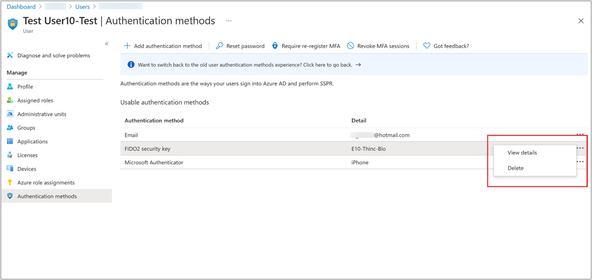
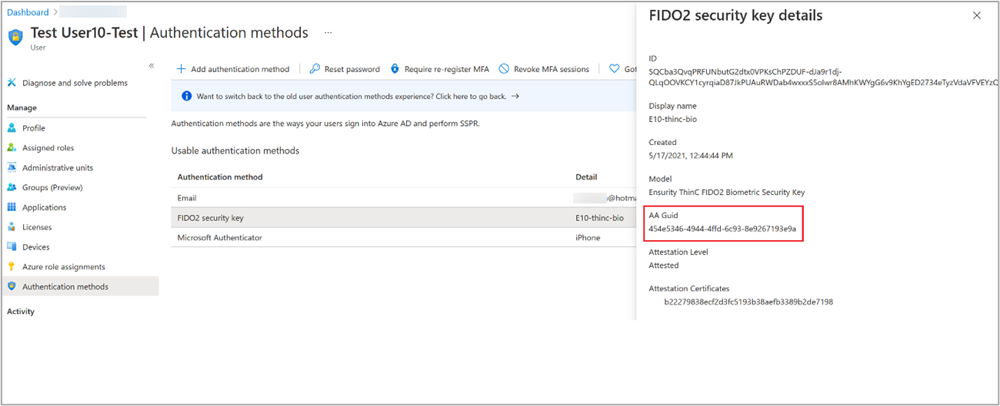

# パスワードなしのセキュリティ キー サインインを有効にする 

現在パスワードを使用していて、共有 PC 環境がある企業では、セキュリティ キーにより、ユーザー名やパスワードを入力しないで認証を行うシームレスな方法が、ワーカーに提供されます。 セキュリティ キーを使うと、ワーカーの生産性が向上し、セキュリティが強化されます。

このドキュメントでは、セキュリティ キーに基づくパスワードレス認証を有効にする方法について説明します。 この記事を最後まで読むと、FIDO2 セキュリティ キーを使用して、お使いの Azure AD アカウントで Web ベースのアプリケーションにサインインできるようになります。

## 必要条件

- [Azure AD Multi-Factor Authentication](howto-mfa-getstarted.md)
- [統合されたセキュリティ情報の登録](concept-registration-mfa-sspr-combined.md)の有効化
- 互換性のある [FIDO2 セキュリティ キー](concept-authentication-passwordless.md#fido2-security-keys)
- WebAuthN requires Windows 10 バージョン 1903 以降**

Web アプリやサービスへのログインにセキュリティ キーを使用するには、WebAuthN プロトコルをサポートするブラウザーが必要です。 これには、Microsoft Edge、Chrome、Firefox、Safari などが含まれます。

## デバイスを準備する

Azure AD 参加済みデバイスでは、Windows 10 バージョン 1903 以降を使用することをお勧めします。

Hybrid Azure AD 参加済みデバイスでは、Windows 10 バージョン 2004 以降が実行されている必要があります。

## パスワードなしの認証方法を有効にする

### 統合された登録エクスペリエンスを有効にする

パスワードなしの認証方法の登録機能は、統合された登録機能に依存しています。 [統合されたセキュリティ情報の登録の有効化](howto-registration-mfa-sspr-combined.md)に関する記事に記載されている手順に従って、統合された登録を有効にします。

### FIDO2 セキュリティ キーの方法を有効にする

1. [Azure portal](https://portal.azure.com) にサインインします。
1. **[Azure Active Directory]**  >  **[セキュリティ]**  >  **[認証方法]**  >  **[認証方法ポリシー]** の順に移動します。
1. 方法 **[FIDO2 セキュリティ キー]** で、次のオプションを選択します。
   1. **有効にする** - [はい] または [いいえ]
   1. **ターゲット** - [すべてのユーザー] または [ユーザーの選択]
1. 構成を **保存** します。

   >[!NOTE]
   >保存しようとしたときにエラーが表示される場合は、追加されているユーザーまたはグループの数が原因である可能性があります。 回避策として、追加しようとしているユーザーとグループを 1 つのグループに置き換え、同じ操作で、もう一度 **[保存]** をクリックします。

### FIDO セキュリティ キーのオプションの設定 

テナントごとにセキュリティ キーを管理するためのオプションの設定がいくつかあります。  

 

**全般**

- **[セルフサービス セットアップを許可する]** を **[はい]** に設定したままにしてください。 [いいえ] に設定すると、認証方法ポリシーによって有効になっている場合でも、MySecurityInfo ポータルを使用して FIDO キーを登録できなくなります。  
- **[Enforce attestation]** \(構成証明の強制\) を **[はい]** に設定するには、FIDO セキュリティ キーのメタデータを FIDO アライアンス メタデータ サービスで公開および検証する必要があります。また、マイクロソフトのその他の検証テスト セットにも合格する必要があります。 詳細については、[「Microsoft と互換性のあるセキュリティ キーとは?」](/windows/security/identity-protection/hello-for-business/microsoft-compatible-security-key)を参照してください。

**キーの制限ポリシー**

- **[Enforce key restrictions]** \(キー制限の強制\) は、組織が特定の FIDO セキュリティキー (AAGuids によって識別される) のみを許可または禁止する場合にのみ、 **[はい]** に設定してください。 自分のデバイスの AAGuids を確認するには、セキュリティ キー プロバイダーと協力してください。 キーが既に登録されている場合は、ユーザーごとのキーの認証方法の詳細を表示することで、AAGUID も検索できます。 

## キーを無効にする 

ユーザー アカウントにひも付けている FIDO2 キーを削除するには、ユーザーの認証方法からキーを削除します。

1. Azure AD のポータルにログインし、FIDO キーを削除するユーザー アカウントを見つけます。
1. **[Authentication methods]\(認証方法\)** で **[FIDO2 security key]\(FIDO2 セキュリティ キー\)** を右クリックし、 **[Delete]\(削除\)** をクリックします。 

    

## セキュリティ キー認証子構成証明 GUID (AAGUID)

FIDO2 の仕様では、構成証明時に、セキュリティ キーの各提供者が認証子構成証明 GUID (AAGUID) を提供する必要があります。 AAGUID は、製造元やモデルなどのキーの種類を表す 128 ビットの識別子です。 

>[!NOTE]
>製造元は、この製造元が作成した実質的に同一であるすべてのキーについて、 AAGUID が同じであり、他のあらゆる種類のキーとは (高確率で) AAGUID が異なることを保証する必要があります。 これを保証するため、特定の種類のセキュリティ キーの AAGUID はランダムに生成するべきです。 詳しくは[「Web Authentication: An API for accessing Public Key Credentials - Level 2」(w3.org)](https://w3c.github.io/webauthn/) (Web 認証: 公開キー認証情報にアクセスする API - レベル 2) をご覧ください。

AAGUID の取得方法は 2 つあります。 セキュリティ キーの提供者に問い合わせる方法と、ユーザー別のキー認証方法の詳細を見る方法があります。

## FIDO2 セキュリティ キーのユーザー登録と管理

1. [https://myprofile.microsoft.com](https://myprofile.microsoft.com) を参照します。
1. まだしていない場合はサインインします。
1. **[セキュリティ情報]** をクリックします。
   1. ユーザーが既に 1 つ以上の Azure AD Multi-Factor Authentication 方法を登録している場合は、FIDO2 セキュリティ キーをすぐに登録することができます。
   1. 少なくとも 1 つの Azure AD Multi-Factor Authentication 方法を登録していない場合は、いずれかを追加する必要があります。
1. **[方法の追加]** をクリックし、 **[セキュリティ キー]** を選択して、FIDO2 セキュリティ キーを追加します。
1. **[USB デバイス]** または **[NFC デバイス]** を選択します。
1. キーを準備し、 **[次へ]** を選択します。
1. ボックスが表示され、ユーザーは、セキュリティ キーの PIN を作成/入力してから、生体認証または指紋認証でキーに必要なジェスチャを実行するよう求められます。
1. ユーザーは、結合された登録エクスペリエンスに戻り、キーが複数ある場合にキーを見分けられるよう、わかりやすい名前を指定することを求められます。 **[次へ]** をクリックします。
1. **[完了]** をクリックしてプロセスを完了します。

## パスワードなしの資格情報でサインインする

以下の例では、ユーザーは既に自分の FIDO2 セキュリティ キーをプロビジョニングしています。 ユーザーは、Windows 10 バージョン 1903 以降のサポートされているブラウザーで FIDO2 セキュリティ キーを使用して、Web 上でサインインすることを選択できます。

## トラブルシューティングとフィードバック

この機能についてフィードバックを共有したい場合、または問題が発生した場合は、次の手順を使用して Windows フィードバック Hub アプリ経由で共有してください。

1. **フィードバック ハブ** を起動し、サインインしていることを確認します。
1. 次の分類でフィードバックを送信します。
   - カテゴリ:セキュリティとプライバシー
   - サブカテゴリ: FIDO
1. ログをキャプチャするには、 **[Recreate my Problem]\(問題の再現\)** オプションを使用します。

## 既知の問題

### セキュリティ キーのプロビジョニング

管理者がセキュリティ キーをプロビジョニングし、それをプロビジョニング解除することはできません。

### UPN の変更

ユーザーの UPN が変更されると、その変更に対応するために FIDO2 セキュリティ キーを変更することはできなくなります。 FIDO2 セキュリティ キーを持つユーザーは、MySecurityInffo にログインして古いキーを削除し、新しいキーを追加することで、この問題を解決できます。

## 次のステップ

[FIDO2 セキュリティ キーでの Windows 10 のサインイン](howto-authentication-passwordless-security-key-windows.md)

[オンプレミスのリソースに対する FIDO2 認証を有効にする](howto-authentication-passwordless-security-key-on-premises.md)

[デバイス登録の詳細](../devices/overview.md)

[Azure AD Multi-factor Authentication の詳細](../authentication/howto-mfa-getstarted.md)