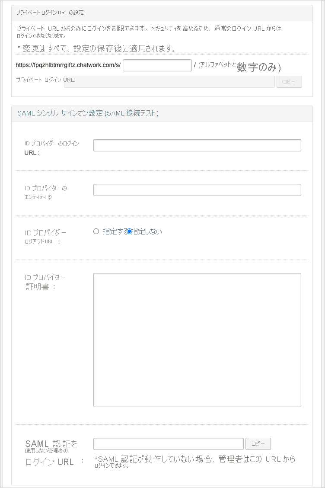
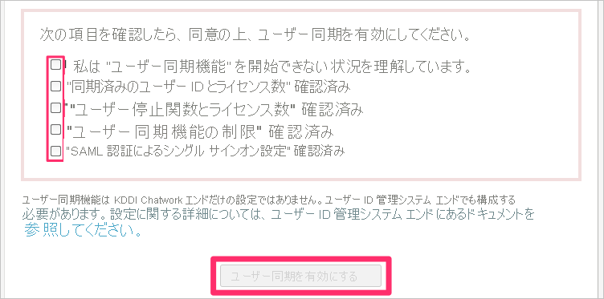

# チュートリアル: Chatwork を構成し、自動ユーザー プロビジョニングに対応させる

このチュートリアルでは、自動ユーザー プロビジョニングを構成するために Chatwork と Azure Active Directory (Azure AD) の両方で行う必要がある手順について説明します。 構成すると、Azure AD プロビジョニング サービスを使用した [Chatwork](https://corp.chatwork.com/) へのユーザーとグループのプロビジョニングおよびプロビジョニング解除が、Azure AD により自動的に行われます。 このサービスが実行する内容、しくみ、よく寄せられる質問の重要な詳細については、「[Azure Active Directory による SaaS アプリへのユーザー プロビジョニングとプロビジョニング解除の自動化](../app-provisioning/user-provisioning.md)」を参照してください。 

## サポートされる機能
> [!div class="checklist"]
> * Chatwork にユーザーを作成する。
> * アクセスが不要になった Chatwork のユーザーを削除する。
> * Azure AD と Chatwork の間でのユーザー属性の同期を維持する。
> * Chatwork への[シングル サインオン](chatwork-tutorial.md) (必須)。

## 前提条件

このチュートリアルで説明するシナリオでは、次の前提条件目があることを前提としています。

* [Azure AD テナント](../develop/quickstart-create-new-tenant.md)。 
* プロビジョニングを構成するための[アクセス許可](../roles/permissions-reference.md)を持つ Azure AD のユーザー アカウント (アプリケーション管理者、クラウド アプリケーション管理者、アプリケーション所有者、グローバル管理者など)。 
* [Chatwork](https://corp.chatwork.com/) テナント。
* 管理者権限を持つ Chatwork のユーザー アカウント。
* Chatwork Enterprise プランまたは KDDI Chatwork を契約している組織。

## 手順 1. プロビジョニングのデプロイを計画する
1. [プロビジョニング サービスのしくみ](../app-provisioning/user-provisioning.md)を確認します。
1. [プロビジョニングの対象](../app-provisioning/define-conditional-rules-for-provisioning-user-accounts.md)となるユーザーを決定します。
1. [Azure AD と Chatwork の間でマップする](../app-provisioning/customize-application-attributes.md)データを決定します。 

## 手順 2. Azure AD によるプロビジョニングをサポートするように Chatwork を構成する

### 1. Chatwork 管理者ページから **[User Synchronization]\(ユーザーの同期\)** を開く

管理者権限を持つユーザーとして Chatwork 管理者ポータルにアクセスします。 管理者特権を持っている場合は、 **[User Synchronization]\(ユーザーの同期\)** ページにアクセスできます。 

**[User Synchronization]\(ユーザーの同期\)** ページには、ユーザー プロビジョニング機能を使用するための注意事項と制限事項が記載されています。 すべての項目にチェックを入れてください。

![[User Synchronization]\(ユーザーの同期\) ページ](media/chatwork-provisioning-tutorial/chatwork-sync.png)

### 2. SAML ログイン設定を構成する。

Azure AD とユーザー プロビジョニングを使用している場合は、Azure AD ID を使用して Chatwork にログインします。 

### 3. 各項目に同意したうえで、チェックボックスをオンにする。

ユーザー プロビジョニング機能の使用に関する注意事項と制限事項に同意したうえで、チェックボックスをオンにします。

すべての項目にチェックを入れたら、 **[Enable user synchronization]\(ユーザーの同期を有効にする\)** ボタンをクリックします。

ユーザー プロビジョニング機能が有効になると、ページの上部に、有効になったことを示すメッセージが表示されます。

## 手順 3. Azure AD アプリケーション ギャラリーから Chatwork を追加する

Azure AD アプリケーション ギャラリーから Chatwork を追加して、Chatwork へのプロビジョニングの管理を開始します。 以前に Chatwork で SSO を設定したことがある場合は、その同じアプリケーションを使用できます。 ただし、統合を初めてテストするときは、別のアプリを作成することをお勧めします。 ギャラリーからアプリケーションを追加する方法の詳細については、[こちら](../manage-apps/add-application-portal.md)を参照してください。

## 手順 4. プロビジョニングの対象となるユーザーを定義する 

Azure AD プロビジョニング サービスを使用すると、アプリケーションへの割り当て、ユーザーまたはグループの属性に基づいてプロビジョニングされるユーザーのスコープを設定できます。 割り当てに基づいてアプリにプロビジョニングされるユーザーのスコープを設定する場合、以下の[手順](../manage-apps/assign-user-or-group-access-portal.md)を使用して、ユーザーとグループをアプリケーションに割り当てることができます。 ユーザーまたはグループの属性のみに基づいてプロビジョニングされるユーザーのスコープを設定する場合、[こちら](../app-provisioning/define-conditional-rules-for-provisioning-user-accounts.md)で説明されているスコープ フィルターを使用できます。 

* Chatwork にユーザーとグループを割り当てる場合は、**既定のアクセス** 以外のロールを選択する必要があります。 既定のアクセス ロールを持つユーザーは、プロビジョニングから除外され、プロビジョニング ログで実質的に資格がないとマークされます。 アプリケーションで使用できる唯一のロールが既定のアクセス ロールである場合は、[アプリケーション マニフェストを更新](../develop/howto-add-app-roles-in-azure-ad-apps.md)してロールを追加することができます。 

* 小さいところから始めましょう。 全員にロールアウトする前に、少数のユーザーとグループでテストします。 プロビジョニングのスコープが割り当て済みユーザーとグループに設定される場合、これを制御するには、1 つまたは 2 つのユーザーまたはグループをアプリに割り当てます。 スコープがすべてのユーザーとグループに設定されている場合は、[属性ベースのスコープ フィルター](../app-provisioning/define-conditional-rules-for-provisioning-user-accounts.md)を指定できます。 

## 手順 5. Chatwork への自動ユーザー プロビジョニングを構成する 

このセクションでは、Azure AD でのユーザー、グループ、またはその両方の割り当てに基づいて、Chatwork でユーザー、グループ、またはその両方が作成、更新、および無効化されるように Azure AD プロビジョニング サービスを構成する手順について説明します。

### Azure AD で Chatwork の自動ユーザー プロビジョニングを構成するには:

1. [Azure portal](https://portal.azure.com) にサインインします。 **[エンタープライズ アプリケーション]** を選択し、 **[すべてのアプリケーション]** を選択します。

    ![[エンタープライズ アプリケーション] ブレード](common/enterprise-applications.png)

1. アプリケーションの一覧で **[Chatwork]** を選択します。

    

1. **[プロビジョニング]** タブを選択します。

    ![[プロビジョニング] タブ](common/provisioning.png)

1. **[プロビジョニング モード]** を **[自動]** に設定します。

    ![[プロビジョニング] タブの [自動]](common/provisioning-automatic.png)

1. **[管理者資格情報]** セクションで、[承認] をクリックし、Chatwork アカウントの管理者資格情報を入力していることを確認します。 **[接続をテスト]** をクリックして、Azure AD から Chatwork に接続できることを確認します。 接続できない場合は、使用中の Chatwork アカウントに管理者権限があることを確認してから、もう一度試します。

   
1. **[通知用メール]** フィールドに、プロビジョニングのエラー通知を受け取るユーザーまたはグループの電子メール アドレスを入力して、 **[エラーが発生したときにメール通知を送信します]** チェック ボックスをオンにします。

    

1. **[保存]** を選択します。

1. **[マッピング]** セクションで、 **[Synchronize Azure Active Directory Users to Chatwork]\(Azure Active Directory ユーザーを Chatwork に同期する\)** を選択します。

1. **[属性マッピング]** セクションで、Azure AD から Chatwork に同期されるユーザー属性を確認します。 **[照合]** プロパティとして選択されている属性を使用して、Chatwork での更新処理でユーザー アカウントが照合されます。 [照合する対象の属性](../app-provisioning/customize-application-attributes.md)を変更する場合は、その属性に基づいたユーザーのフィルター処理が Chatwork API で確実にサポートされている必要があります。 **[保存]** ボタンをクリックして変更をコミットします。

   |属性|Type|フィルター処理のサポート|
   |---|---|---|
   |userName|String|&check;
   |active|Boolean|   
   |title|String|
   |externalId|String|
   |urn:ietf:params:scim:schemas:extension:enterprise:2.0:User:department|String|
   |urn:ietf:params:scim:schemas:extension:enterprise:2.0:User:organization|String|

1. スコープ フィルターを構成するには、[スコープ フィルターのチュートリアル](../app-provisioning/define-conditional-rules-for-provisioning-user-accounts.md)の次の手順を参照してください。

1. Chatwork に対して Azure AD プロビジョニング サービスを有効にするには、 **[設定]** セクションで **[プロビジョニング状態]** を **[オン]** に変更します。

    ![プロビジョニングの状態を [オン] に切り替える](common/provisioning-toggle-on.png)

1. **[設定]** セクションの **[スコープ]** で目的の値を選択することで、Chatwork にプロビジョニングするユーザーまたはグループ、あるいはその両方を定義します。

    

1. プロビジョニングの準備ができたら、 **[保存]** をクリックします。

    

この操作により、 **[設定]** セクションの **[スコープ]** で定義したすべてのユーザーとグループの初期同期サイクルが開始されます。 初期サイクルは後続の同期よりも実行に時間がかかります。後続のサイクルは、Azure AD のプロビジョニング サービスが実行されている限り約 40 分ごとに実行されます。 

## 手順 6. デプロイを監視する
プロビジョニングを構成したら、次のリソースを使用してデプロイを監視します。

* [プロビジョニング ログ](../reports-monitoring/concept-provisioning-logs.md)を使用して、正常にプロビジョニングされたユーザーと失敗したユーザーを特定します。
* [進行状況バー](../app-provisioning/application-provisioning-when-will-provisioning-finish-specific-user.md)を確認して、プロビジョニング サイクルの状態と完了までの時間を確認します。
* プロビジョニング構成が異常な状態になったと考えられる場合、アプリケーションは検疫されます。 検疫状態の詳細については、[こちら](../app-provisioning/application-provisioning-quarantine-status.md)を参照してください。  

## その他のリソース

* [エンタープライズ アプリのユーザー アカウント プロビジョニングの管理](../app-provisioning/configure-automatic-user-provisioning-portal.md)
* [Azure Active Directory のアプリケーション アクセスとシングル サインオンとは](../manage-apps/what-is-single-sign-on.md)

## 次のステップ

* [プロビジョニング アクティビティのログの確認方法およびレポートの取得方法](../app-provisioning/check-status-user-account-provisioning.md)