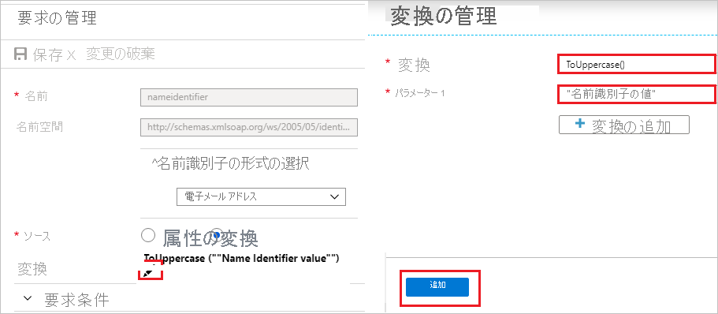

# チュートリアル:Azure Active Directory シングル サインオン (SSO) と Discovery Benefits SSO の統合

このチュートリアルでは、Discovery Benefits SSO と Azure Active Directory (Azure AD) を統合する方法について説明します。 Discovery Benefits SSO を Azure AD に統合すると、次のことができます。

* Discovery Benefits SSO にアクセス可能な Azure AD ユーザーを制御する。
* ユーザーが自分の Azure AD アカウントを使用して Discovery Benefits SSO に自動的にサインインできるようにする。
* 1 つの中央サイト (Azure Portal) で自分のアカウントを管理します。

## 前提条件

開始するには、次が必要です。

* Azure AD サブスクリプション。 サブスクリプションがない場合は、[無料アカウント](https://azure.microsoft.com/free/)を取得できます。
* Discovery Benefits SSO でのシングル サインオン (SSO) が有効なサブスクリプション。

## シナリオの説明

このチュートリアルでは、テスト環境で Azure AD の SSO を構成してテストします。

* Discovery Benefits SSO では、**IDP** Initiated SSO がサポートされます。

> [!NOTE]
> このアプリケーションの識別子は固定文字列値であるため、1 つのテナントで構成できるインスタンスは 1 つだけです。

## ギャラリーからの Discovery Benefits SSO の追加

Azure AD への Discovery Benefits SSO の統合を構成するには、ギャラリーからマネージド SaaS アプリの一覧に Discovery Benefits SSO を追加する必要があります。

1. 職場または学校アカウントか、個人の Microsoft アカウントを使用して、Azure portal にサインインします。
1. 左のナビゲーション ウィンドウで **[Azure Active Directory]** サービスを選択します。
1. **[エンタープライズ アプリケーション]** に移動し、 **[すべてのアプリケーション]** を選択します。
1. 新しいアプリケーションを追加するには、 **[新しいアプリケーション]** を選択します。
1. **[ギャラリーから追加する]** セクションで、検索ボックスに「**Discovery Benefits SSO**」と入力します。
1. 結果のパネルから **[Discovery Benefits SSO]** を選択し、アプリを追加します。 お使いのテナントにアプリが追加されるのを数秒待機します。

## Discovery Benefits SSO の Azure AD SSO の構成とテスト

**B.Simon** というテスト ユーザーを使用して、Discovery Benefits SSO に対する Azure AD SSO を構成してテストします。 SSO を機能させるには、Azure AD ユーザーと Discovery Benefits SSO の関連ユーザーとの間にリンク関係を確立する必要があります。

Discovery Benefits SSO で Azure AD SSO を構成してテストするには、次の項目を完了する必要があります。

1. **[Azure AD SSO の構成](#configure-azure-ad-sso)** - ユーザーがこの機能を使用できるようにします。
    1. **[Azure AD のテスト ユーザーの作成](#create-an-azure-ad-test-user)** - B.Simon で Azure AD のシングル サインオンをテストします。
    1. **[Azure AD テスト ユーザーの割り当て](#assign-the-azure-ad-test-user)** - B.Simon が Azure AD シングル サインオンを使用できるようにします。
1. **[Discovery Benefits SSO の構成](#configure-discovery-benefits-sso)** - アプリケーション側でシングル サインオン設定を構成します。
    1. **[Discovery Benefits SSO テスト ユーザーの作成](#create-discovery-benefits-sso-test-user)** - Discovery Benefits SSO で B.Simon に対応するユーザーを作成し、Azure AD の B.Simon にリンクさせます。
1. **[SSO のテスト](#test-sso)** - 構成が機能するかどうかを確認します。

## Azure AD SSO の構成

これらの手順に従って、Azure portal で Azure AD SSO を有効にします。

1. Azure portal の **Discovery Benefits SSO** アプリケーション統合ページで、 **[管理]** セクションを見つけて、 **[シングル サインオン]** を選択します。
1. **[シングル サインオン方式の選択]** ページで、 **[SAML]** を選択します。
1. **[SAML によるシングル サインオンのセットアップ]** ページで、 **[基本的な SAML 構成]** の鉛筆アイコンをクリックして設定を編集します。

   

1. **[基本的な SAML 構成]** セクションでは、アプリケーションは **IDP** 開始モードで事前に構成されており、必要な URL は既に Azure で事前に設定されています。 構成を保存するには、 **[保存]** ボタンをクリックします。

1. Discovery Benefits SSO アプリケーションは特定の形式の SAML アサーションを予測しているため、SAML トークン属性の構成にカスタム属性マッピングを追加する必要があります。 次のスクリーンショットには、既定の属性一覧が示されています。 **[編集]** アイコンをクリックして、[ユーザー属性] ダイアログを開きます。

    

    a. **[編集]** アイコンをクリックして、 **[一意のユーザー識別子 (名前 ID)]** ダイアログを開きます。

    ![[必要な要求] の右側の省略記号が選択された [ユーザー属性と要求] セクションを示すスクリーンショット。](./media/discovery-benefits-sso-tutorial/user-attribute.png)

    

    b. **[編集]** アイコンをクリックして、 **[変換の管理]** ダイアログを開きます。

    c. **[変換]** ボックスに、その行に対して表示される「**ToUppercase()** 」を入力します。

    d. **[パラメーター 1]** ボックスに、`<Name Identifier value>`のようなパラメーターを入力します。

    e. **[追加]** をクリックします。

    > [!NOTE]
    > Discovery Benefits SSO では、この統合を機能させるために、固定文字列値を **[一意のユーザー ID (名前 ID)]** フィールドに渡す必要があります。 現在、Azure AD ではこの機能がサポートされていないため、回避策として、NameID の **ToUpper** または **ToLower** 変換を使用して、固定文字列値を設定できます (上のスクリーンショットを参照)。

    f. SSO の構成に必要な追加の要求 (`SSOInstance` および `SSOID`) が自動的に設定されました。 **鉛筆** アイコンを使用して、組織に応じて値をマップします。

    !["S S O Instance" と "S S O I D" の値が強調表示された [ユーザー属性と要求] を示すスクリーンショット。](./media/discovery-benefits-sso-tutorial/new-attribute.png)

1. **[SAML でシングル サインオンをセットアップします]** ページの **[SAML 署名証明書]** セクションで、 **[証明書 (Base64)]** を見つけて、 **[ダウンロード]** を選択し、証明書をダウンロードして、お使いのコンピューターに保存します。

    

1. **[Discovery Benefits SSO のセットアップ]** セクションで、要件に基づいて適切な URL をコピーします。

    

### Azure AD のテスト ユーザーの作成

このセクションでは、Azure portal 内で B.Simon というテスト ユーザーを作成します。

1. Azure portal の左側のウィンドウから、 **[Azure Active Directory]** 、 **[ユーザー]** 、 **[すべてのユーザー]** の順に選択します。
1. 画面の上部にある **[新しいユーザー]** を選択します。
1. **[ユーザー]** プロパティで、以下の手順を実行します。
   1. **[名前]** フィールドに「`B.Simon`」と入力します。  
   1. **[ユーザー名]** フィールドに「username@companydomain.extension」と入力します。 たとえば、「 `B.Simon@contoso.com` 」のように入力します。
   1. **[パスワードを表示]** チェック ボックスをオンにし、 **[パスワード]** ボックスに表示された値を書き留めます。
   1. **Create** をクリックしてください。

### Azure AD テスト ユーザーの割り当て

このセクションでは、B.Simon に Discovery Benefits SSO へのアクセスを許可することで、このユーザーが Azure シングル サインオンを使用できるようにします。

1. Azure portal で **[エンタープライズ アプリケーション]** を選択し、 **[すべてのアプリケーション]** を選択します。
1. アプリケーションの一覧で **[Discovery Benefits SSO]** を選択します。
1. アプリの概要ページで、 **[管理]** セクションを見つけて、 **[ユーザーとグループ]** を選択します。
1. **[ユーザーの追加]** を選択し、 **[割り当ての追加]** ダイアログで **[ユーザーとグループ]** を選択します。
1. **[ユーザーとグループ]** ダイアログの [ユーザー] の一覧から **[B.Simon]** を選択し、画面の下部にある **[選択]** ボタンをクリックします。
1. ユーザーにロールが割り当てられることが想定される場合は、 **[ロールの選択]** ドロップダウンからそれを選択できます。 このアプリに対してロールが設定されていない場合は、[既定のアクセス] ロールが選択されていることを確認します。
1. **[割り当ての追加]** ダイアログで、 **[割り当て]** をクリックします。

## Discovery Benefits SSO の構成

**Discovery Benefits SSO** 側でシングル サインオンを構成するには、ダウンロードした **証明書 (Base64)** と Azure portal からコピーした適切な URL を [Discovery Benefits SSO のサポート チーム](mailto:Jsimpson@DiscoveryBenefits.com)に送信する必要があります。 サポート チームはこれを設定して、SAML SSO 接続が両方の側で正しく設定されるようにします。

### Discovery Benefits SSO テスト ユーザーの作成

このセクションでは、Discovery Benefits SSO で Britta Simon というユーザーを作成します。 [Discovery Benefits SSO のサポート チーム](mailto:Jsimpson@DiscoveryBenefits.com)と連携して、Discovery Benefits SSO プラットフォームにユーザーを追加してください。 シングル サインオンを使用する前に、ユーザーを作成し、有効化する必要があります。

## SSO のテスト 

このセクションでは、次のオプションを使用して Azure AD のシングル サインオン構成をテストします。

* Azure portal で [このアプリケーションをテストします] をクリックすると、SSO を設定した Discovery Benefits SSO に自動的にサインインします。

* Microsoft マイ アプリを使用することができます。 マイ アプリで [Discovery Benefits SSO] タイルをクリックすると、SSO を設定した Discovery Benefits SSO に自動的にサインインします。 マイ アプリの詳細については、[マイ アプリの概要](https://support.microsoft.com/account-billing/sign-in-and-start-apps-from-the-my-apps-portal-2f3b1bae-0e5a-4a86-a33e-876fbd2a4510)に関するページを参照してください。

## 次のステップ

Discovery Benefits SSO を構成したら、組織の機密データを流出と侵入からリアルタイムで保護するセッション制御を適用することができます。 セッション制御は、条件付きアクセスを拡張したものです。 [Microsoft Defender for Cloud Apps でセッション制御を適用する方法をご覧ください](/cloud-app-security/proxy-deployment-aad)。
