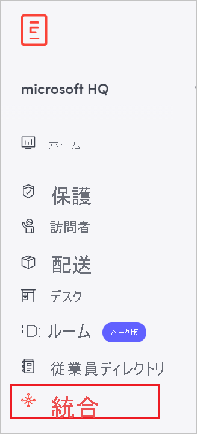
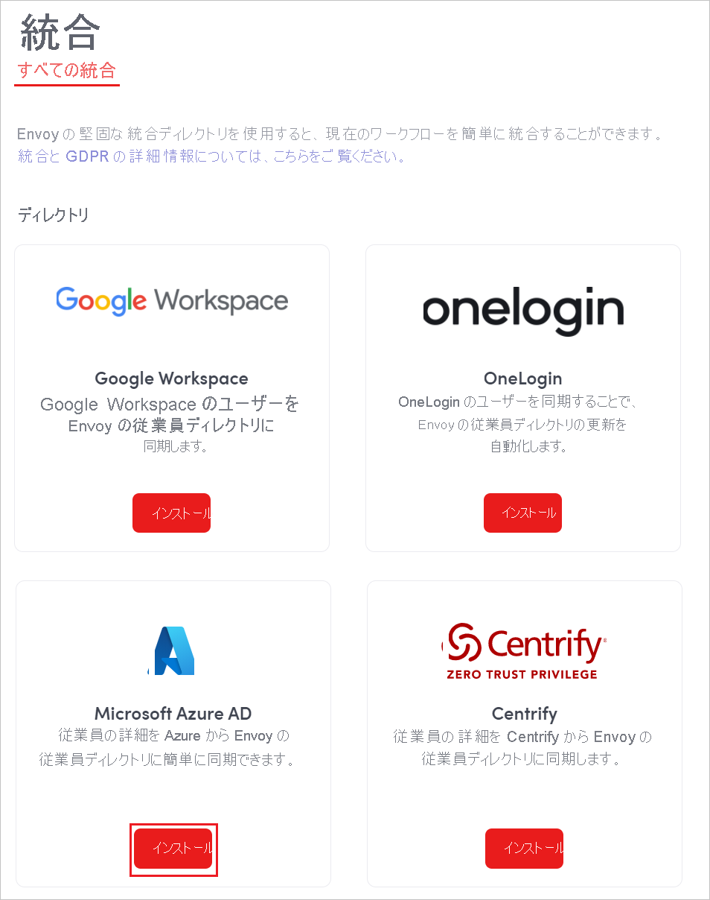
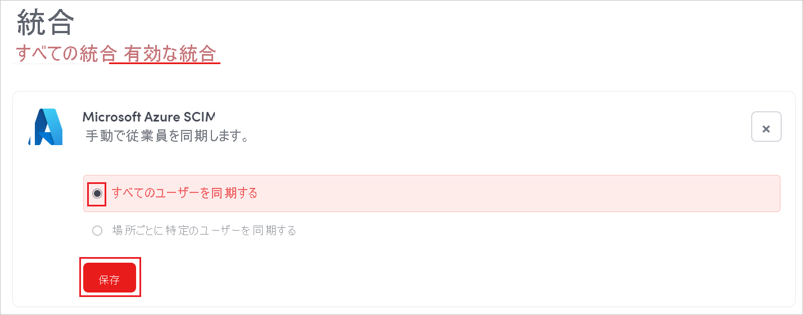
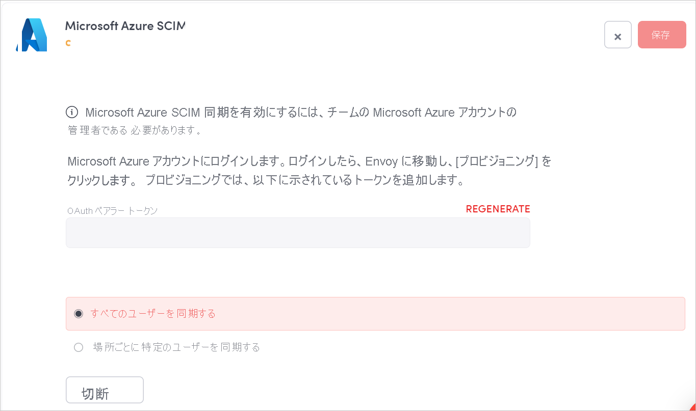

# チュートリアル:Envoy を構成し、自動ユーザー プロビジョニングに対応させる

このチュートリアルでは、自動ユーザー プロビジョニングを構成するために Envoy と Azure Active Directory (Azure AD) の両方で行う必要がある手順について説明します。 構成すると、Azure AD では、Azure AD プロビジョニング サービスを使用して、[Envoy](https://envoy.com/pricing/) に対するユーザーとグループのプロビジョニングおよびプロビジョニング解除が自動的に行われます。 このサービスが実行する内容、しくみ、よく寄せられる質問の重要な詳細については、「[Azure Active Directory による SaaS アプリへのユーザー プロビジョニングとプロビジョニング解除の自動化](../app-provisioning/user-provisioning.md)」を参照してください。 

## サポートされる機能
> [!div class="checklist"]
> * Envoy でユーザーを作成する
> * アクセスが不要になった場合に Envoy のユーザーを削除する
> * Azure AD と Envoy の間でユーザー属性の同期を維持する
> * Envoy でグループとグループ メンバーシップをプロビジョニングする
> * Envoy への[シングル サインオン](./envoy-tutorial.md) (推奨)

## 前提条件

このチュートリアルで説明するシナリオでは、次の前提条件目があることを前提としています。

* [Azure AD テナント](../develop/quickstart-create-new-tenant.md) 
* プロビジョニングを構成するための[アクセス許可](../roles/permissions-reference.md)を持つ Azure AD のユーザー アカウント (アプリケーション管理者、クラウド アプリケーション管理者、アプリケーション所有者、グローバル管理者など)。 
* [Envoy テナント](https://envoy.com/pricing/)。
* Admin アクセス許可がある Envoy のユーザー アカウント。

> [!NOTE]
> この統合は、Azure AD 米国政府クラウド環境から利用することもできます。 このアプリケーションは、Azure AD 米国政府クラウドのアプリケーション ギャラリーにあります。パブリック クラウドの場合と同じように構成してください。

## 手順 1. プロビジョニングのデプロイを計画する
1. [プロビジョニング サービスのしくみ](../app-provisioning/user-provisioning.md)を確認します。
2. [プロビジョニングの対象](../app-provisioning/define-conditional-rules-for-provisioning-user-accounts.md)となるユーザーを決定します。
3. [Azure AD と Envoy の間でマップする](../app-provisioning/customize-application-attributes.md)データを決定します。 

## 手順 2. Azure AD でのプロビジョニングをサポートするように Envoy を構成する

1. [Envoy 管理コンソール](https://dashboard.envoy.com/login)にサインインします。 **[統合]** をクリックします。

    

2. **[Microsoft Azure SCIM integration]\(Microsoft Azure SCIM の統合\)** で **[インストール]** をクリックします。

    

3. **[Sync all users]\(すべてのユーザーを同期\)** で **[保存]** をクリックします。 

    

4. **[OAUTH BEARER TOKEN] (OAUTH ベアラー トークン)** をコピーします。 この値を、Azure portal で Envoy アプリケーションの [プロビジョニング] タブの **[シークレット トークン]** フィールドに入力します。
    
    

## 手順 3. Azure AD アプリケーション ギャラリーから Envoy を追加する

Azure AD アプリケーション ギャラリーから Envoy を追加して、Envoy へのプロビジョニングの管理を開始します。 SSO のために Envoy を以前に設定している場合は、その同じアプリケーションを使用することができます。 ただし、統合を初めてテストするときは、別のアプリを作成することをお勧めします。 ギャラリーからアプリケーションを追加する方法の詳細については、[こちら](../manage-apps/add-application-portal.md)を参照してください。 

## 手順 4. プロビジョニングの対象となるユーザーを定義する 

Azure AD プロビジョニング サービスを使用すると、アプリケーションへの割り当て、ユーザーまたはグループの属性に基づいてプロビジョニングされるユーザーのスコープを設定できます。 割り当てに基づいてアプリにプロビジョニングされるユーザーのスコープを設定する場合、以下の[手順](../manage-apps/assign-user-or-group-access-portal.md)を使用して、ユーザーとグループをアプリケーションに割り当てることができます。 ユーザーまたはグループの属性のみに基づいてプロビジョニングされるユーザーのスコープを設定する場合、[こちら](../app-provisioning/define-conditional-rules-for-provisioning-user-accounts.md)で説明されているスコープ フィルターを使用できます。 

* Envoy にユーザーとグループを割り当てるときは、**既定のアクセス** 以外のロールを選択する必要があります。 既定のアクセス ロールを持つユーザーは、プロビジョニングから除外され、プロビジョニング ログで実質的に資格がないとマークされます。 アプリケーションで使用できる唯一のロールが既定のアクセス ロールである場合は、[アプリケーション マニフェストを更新](../develop/howto-add-app-roles-in-azure-ad-apps.md)してロールを追加することができます。 

* 小さいところから始めましょう。 全員にロールアウトする前に、少数のユーザーとグループでテストします。 プロビジョニングのスコープが割り当て済みユーザーとグループに設定される場合、これを制御するには、1 つまたは 2 つのユーザーまたはグループをアプリに割り当てます。 スコープがすべてのユーザーとグループに設定されている場合は、[属性ベースのスコープ フィルター](../app-provisioning/define-conditional-rules-for-provisioning-user-accounts.md)を指定できます。 

## 手順 5. Envoy への自動ユーザー プロビジョニングを構成する 

このセクションでは、Azure AD でのユーザー、グループ、またはその両方の割り当てに基づいて、TestApp でユーザー、グループ、またはその両方が作成、更新、および無効化されるように Azure AD プロビジョニング サービスを構成する手順について説明します。

### Azure AD で Envoy の自動ユーザー プロビジョニングを構成するには、次の操作を実行します。

1. [Azure portal](https://portal.azure.com) にサインインします。 **[エンタープライズ アプリケーション]** を選択し、 **[すべてのアプリケーション]** を選択します。

    ![[エンタープライズ アプリケーション] ブレード](common/enterprise-applications.png)

2. アプリケーションの一覧で **[Envoy]** を選択します。

    

3. **[プロビジョニング]** タブを選択します。

    ![[プロビジョニング] オプションが強調表示された [管理] オプションのスクリーンショット。](common/provisioning.png)

4. **[プロビジョニング モード]** を **[自動]** に設定します。

    ![[自動] オプションが強調表示された [プロビジョニング モード] ドロップダウン リストのスクリーンショット。](common/provisioning-automatic.png)

5. **[管理者資格情報]** セクションの **[テナントの URL]** に「`https://app.envoy.com/scim/v2`」と入力します。 **[シークレット トークン]** で以前に取得した **[OAUTH BEARER TOKEN] (OAUTH ベアラー トークン)** の値を入力します。 **[テスト接続]** をクリックして、Azure AD から Envoy への接続を確認します。 接続できない場合は、使用中の Envoy アカウントに管理者アクセス許可があることを確認してから、もう一度試します。

   ![テナント URL とシークレット トークンを入力できる場所である [管理者資格情報] ダイアログ ボックスを示すスクリーンショット。](./media/envoy-tutorial/provisioning.png)

6. **[通知用メール]** フィールドに、プロビジョニングのエラー通知を受け取るユーザーまたはグループの電子メール アドレスを入力して、 **[エラーが発生したときにメール通知を送信します]** チェック ボックスをオンにします。

    

7. **[保存]** を選択します。

8. **[マッピング]** セクションの **[Synchronize Azure Active Directory Users to Envoy]\(Azure Active Directory ユーザーを Envoy に同期する\)** を選択します。

9. **[属性マッピング]** セクションで、Azure AD から Envoy に同期されるユーザー属性を確認します。 **[照合]** プロパティとして選択されている属性は、更新処理で Envoy のユーザー アカウントとの照合に使用されます。 [一致する対象の属性](../app-provisioning/customize-application-attributes.md)を変更する場合は、その属性に基づいたユーザーのフィルター処理が確実に Envoy API でサポートされているようにする必要があります。 **[保存]** ボタンをクリックして変更をコミットします。

   |属性|Type|
   |---|---|
   |userName|String|
   |externalId|String|
   |displayName|String|
   |title|String|
   |emails[type eq "work"].value|String|
   |preferredLanguage|String|
   |department|String|
   |addresses[type eq "work"].country|String|
   |addresses[type eq "work"].locality|String|
   |addresses[type eq "work"].region|String|
   |addresses[type eq "work"].postalCode|String|
   |addresses[type eq "work"].formatted|String|
   |addresses[type eq "work"].streetAddress|String|
   |name.givenName|String|
   |name.familyName|String|
   |name.formatted|String|
   |phoneNumbers[type eq "mobile"].value|String|
   |phoneNumbers[type eq "work"].value|String|
   |locale|String|

10. **[マッピング]** セクションの **[Synchronize Azure Active Directory Groups to Envoy]\(Azure Active Directory グループを Envoy に同期する\)** を選択します。

11. **[属性マッピング]** セクションで、Azure AD から Envoy に同期されるグループ属性を確認します。 **[照合]** プロパティとして選択されている属性は、更新処理で Envoy のグループとの照合に使用されます。 **[保存]** ボタンをクリックして変更をコミットします。

      |属性|Type|
      |---|---|
      |displayName|String|
      |externalId|String|
      |members|リファレンス|

12. スコープ フィルターを構成するには、[スコープ フィルターのチュートリアル](../app-provisioning/define-conditional-rules-for-provisioning-user-accounts.md)の次の手順を参照してください。

13. Envoy に対して Azure AD プロビジョニング サービスを有効にするには、 **[設定]** セクションで **[プロビジョニング状態]** を **[オン]** に変更します。

    ![プロビジョニングの状態を [オン] に切り替える](common/provisioning-toggle-on.png)

14. **[設定]** セクションの **[スコープ]** で目的の値を選択して、Envoy にプロビジョニングするユーザーやグループを定義します。

    

15. プロビジョニングの準備ができたら、 **[保存]** をクリックします。

    

この操作により、 **[設定]** セクションの **[スコープ]** で定義したすべてのユーザーとグループの初期同期サイクルが開始されます。 初期サイクルは後続の同期よりも実行に時間がかかります。後続のサイクルは、Azure AD のプロビジョニング サービスが実行されている限り約 40 分ごとに実行されます。 

## 手順 6. デプロイを監視する
プロビジョニングを構成したら、次のリソースを使用してデプロイを監視します。

* [プロビジョニング ログ](../reports-monitoring/concept-provisioning-logs.md)を使用して、正常にプロビジョニングされたユーザーと失敗したユーザーを特定します。
* [進行状況バー](../app-provisioning/application-provisioning-when-will-provisioning-finish-specific-user.md)を確認して、プロビジョニング サイクルの状態と完了までの時間を確認します。
* プロビジョニング構成が異常な状態になったと考えられる場合、アプリケーションは検疫されます。 検疫状態の詳細については、[こちら](../app-provisioning/application-provisioning-quarantine-status.md)を参照してください。

## その他のリソース

* [エンタープライズ アプリのユーザー アカウント プロビジョニングの管理](../app-provisioning/configure-automatic-user-provisioning-portal.md)
* [Azure Active Directory のアプリケーション アクセスとシングル サインオンとは](../manage-apps/what-is-single-sign-on.md)

## 次のステップ

* [プロビジョニング アクティビティのログの確認方法およびレポートの取得方法](../app-provisioning/check-status-user-account-provisioning.md)