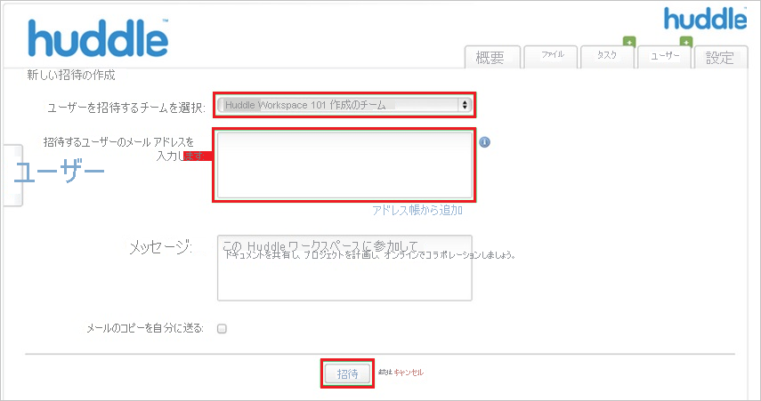

# チュートリアル: Azure AD SSO と Huddle の統合

このチュートリアルでは、Huddle と Azure Active Directory (Azure AD) を統合する方法について説明します。 Azure AD と Huddle を統合すると、次のことが可能になります。

* Huddle にアクセスできるユーザーを Azure AD で制御する。
* ユーザーが自分の Azure AD アカウントを使用して Huddle に自動的にサインインできるようにする。
* 1 つの中央サイト (Azure Portal) で自分のアカウントを管理します。

## 前提条件

開始するには、次が必要です。

* Azure AD サブスクリプション。 サブスクリプションがない場合は、[無料アカウント](https://azure.microsoft.com/free/)を取得できます。
* Huddle でのシングル サインオン (SSO) が有効なサブスクリプション。

## シナリオの説明

このチュートリアルでは、テスト環境で Azure AD のシングル サインオンを構成してテストします。

* Huddle では、**SP Initiated SSO と IDP Initiated SSO** がサポートされます。

> [!NOTE]
> このアプリケーションの識別子は固定文字列値であるため、1 つのテナントで構成できるインスタンスは 1 つだけです。

## ギャラリーから Huddle を追加する

Azure AD への Huddle の統合を構成するには、ギャラリーから管理対象 SaaS アプリの一覧に Huddle を追加する必要があります。

1. 職場または学校アカウントか、個人の Microsoft アカウントを使用して、Azure portal にサインインします。
1. 左のナビゲーション ウィンドウで **[Azure Active Directory]** サービスを選択します。
1. **[エンタープライズ アプリケーション]** に移動し、 **[すべてのアプリケーション]** を選択します。
1. 新しいアプリケーションを追加するには、 **[新しいアプリケーション]** を選択します。
1. **[ギャラリーから追加する]** セクションで、検索ボックスに「**Huddle**」と入力します。
1. 結果のパネルから **[Huddle]** を選択し、アプリを追加します。 お使いのテナントにアプリが追加されるのを数秒待機します。

## Huddle のための Azure AD SSO の構成とテスト

**B.Simon** というテスト ユーザーを使用して、Huddle 用に Azure AD SSO を構成してテストします。 SSO が機能するためには、Azure AD ユーザーと Huddle の関連ユーザーとの間にリンク関係を確立する必要があります。

Huddle 用に Azure AD SSO を構成してテストするには、次の手順を実行します。

1. **[Azure AD SSO の構成](#configure-azure-ad-sso)** - ユーザーがこの機能を使用できるようにします。
    1. **[Azure AD テスト ユーザーの作成](#create-an-azure-ad-test-user)** - B. Simon で Azure AD のシングル サインオンをテストします。
    1. **[Azure AD テスト ユーザーの割り当て](#assign-the-azure-ad-test-user)** - B. Simon が Azure AD シングル サインオンを使用できるようにします。
1. **[Huddle の SSO を構成](#configure-huddle-sso)** して、アプリケーション側で SSO 設定を構成します。
    1. **[Huddle のテスト ユーザーを作成](#create-huddle-test-user)** して、Huddle で B.Simon に対応するユーザーを作成し、Azure AD の B.Simon にリンクさせます。
1. **[SSO のテスト](#test-sso)** - 構成が機能するかどうかを確認します。

## Azure AD SSO の構成

これらの手順に従って、Azure portal で Azure AD SSO を有効にします。

1. Azure portal の **[Huddle]** アプリケーション統合ページで、 **[管理]** セクションを探して、 **[シングル サインオン]** を選択します。
1. **[シングル サインオン方式の選択]** ページで、 **[SAML]** を選択します。
1. **[SAML によるシングル サインオンのセットアップ]** ページで、 **[基本的な SAML 構成]** の鉛筆アイコンをクリックして設定を編集します。

   

4. **[基本的な SAML 構成]** セクションで、アプリケーションを **IDP** 開始モードで構成する場合は、次の手順を実行します。

    > [!NOTE]
    > 下で入力するドメインから Huddle インスタンスが自動的に検出されます。

    a. **[識別子]** テキスト ボックスに、次のいずれかの URL を入力します。

    | **Identifier** |
    |------|
    | `https://login.huddle.net` |
    | `https://login.huddle.com` |

    b. **[応答 URL]** ボックスに、次のいずれかの URL を入力します。

    | **応答 URL** |
    |----|
    | `https://login.huddle.net/saml/browser-sso` |
    | `https://login.huddle.com/saml/browser-sso` |
    | `https://login.huddle.com/saml/idp-initiated-sso` |

5. アプリケーションを **SP** 開始モードで構成する場合は、 **[追加の URL を設定します]** をクリックして次の手順を実行します。

    **[サインオン URL]** ボックスに、次のパターンを使用して URL を入力します。

    | **サインオン URL** |
    |----|
    | `https://<customsubdomain>.huddle.com` |
    | `https://us.huddle.com` |
      
    > [!NOTE]
    > サインオン URL は実際の値ではありません。 実際のサインオン URL でこの値を更新してください。 この値を取得するには、[Huddle クライアント サポート チーム](https://huddle.zendesk.com)に問い合わせてください。

6. **[SAML でシングル サインオンをセットアップします]** ページの **[SAML 署名証明書]** セクションで、 **[ダウンロード]** をクリックして要件のとおりに指定したオプションからの **証明書 (Base64)** をダウンロードして、お使いのコンピューターに保存します。

    

7. **[Set up Huddle]\(Huddle の設定\)** セクションで、要件どおりの適切な URL をコピーします。

    

### Azure AD のテスト ユーザーの作成

このセクションでは、Azure portal 内で B. Simon というテスト ユーザーを作成します。

1. Azure portal の左側のウィンドウから、 **[Azure Active Directory]** 、 **[ユーザー]** 、 **[すべてのユーザー]** の順に選択します。
1. 画面の上部にある **[新しいユーザー]** を選択します。
1. **[ユーザー]** プロパティで、以下の手順を実行します。
   1. **[名前]** フィールドに「`B. Simon`」と入力します。  
   1. **[ユーザー名]** フィールドに「username@companydomain.extension」と入力します。 たとえば、「 `B. Simon@contoso.com` 」のように入力します。
   1. **[パスワードを表示]** チェック ボックスをオンにし、 **[パスワード]** ボックスに表示された値を書き留めます。
   1. **Create** をクリックしてください。

### Azure AD テスト ユーザーの割り当て

このセクションでは、B.Simon に Huddle へのアクセスを許可することで、Azure シングル サインオンを使用できるようにします。

1. Azure portal で **[エンタープライズ アプリケーション]** を選択し、 **[すべてのアプリケーション]** を選択します。
1. アプリケーションの一覧で **[Huddle]\(Huddle\)** を選択します。
1. アプリの概要ページで、 **[管理]** セクションを見つけて、 **[ユーザーとグループ]** を選択します。
1. **[ユーザーの追加]** を選択し、 **[割り当ての追加]** ダイアログで **[ユーザーとグループ]** を選択します。
1. **[ユーザーとグループ]** ダイアログの [ユーザー] の一覧から **[B. Simon]** を選択し、画面の下部にある **[選択]** ボタンをクリックします。
1. SAML アサーション内に任意のロール値が必要な場合、 **[ロールの選択]** ダイアログでユーザーに適したロールを一覧から選択し、画面の下部にある **[選択]** をクリックします。
1. **[割り当ての追加]** ダイアログで、 **[割り当て]** をクリックします。

## Huddle の SSO の構成

**Huddle** 側でシングル サインオンを構成するには、ダウンロードした **証明書 (Base64)** と Azure portal からコピーした適切な URL を [Huddle サポート チーム](https://huddle.zendesk.com/)に送信する必要があります。 サポート チームはこれを設定して、SAML SSO 接続が両方の側で正しく設定されるようにします。

> [!NOTE]
> Huddle サポート チームがシングル サインオンを有効にする必要があります。 構成が完了すると、通知が届きます。

### Huddle のテスト ユーザーの作成

Azure AD ユーザーが Huddle にログインできるようにするには、そのユーザーを Huddle にプロビジョニングする必要があります。 Huddle の場合、プロビジョニングは手動で行います。

**ユーザー プロビジョニングを構成するには、次の手順に従います。**

1. 管理者として **Huddle** の会社サイトにログインします。

2. [**ワークスペース**] をクリックします。

3. **[ユーザー] \>[ユーザーの招待]** の順にクリックします。

    

4. [**新しい招待の作成**] セクションで、次の手順を実行します。
  
    
  
    a. [**チームを選択して参加するユーザーを招待**] の一覧で、[**チーム**] を選択します。

    b. **[Enter email address for people you'd like to invite]\(招待したい人の電子メール アドレスの入力\)** ボックスに、プロビジョニングを行う有効な Azure AD アカウントの **電子メール アドレス** を入力します。

    c. **[招待]** をクリックします。

    > [!NOTE]
    > アカウントがアクティブになる前に、Azure AD アカウント所有者に、アカウント確認用のリンクを含む電子メールが送信されます。

> [!NOTE]
> Huddle から提供されている他の Huddle ユーザー アカウント作成ツールまたは API を使用して、Azure AD ユーザー アカウントをプロビジョニングできます。

## SSO のテスト

このセクションでは、次のオプションを使用して Azure AD のシングル サインオン構成をテストします。 

#### SP Initiated:

* Azure portal で **[このアプリケーションをテストします]** をクリックします。 これにより、Huddle のサインオン URL にリダイレクトされ、そこからログイン フローを開始できます。  

* Huddle のサインオン URL に直接移動し、そこからログイン フローを開始します。

#### IDP Initiated:

* Azure portal で **[このアプリケーションをテストします]** をクリックすると、SSO を設定した Huddle に自動的にサインインされます。 

また、Microsoft マイ アプリを使用して、任意のモードでアプリケーションをテストすることもできます。 マイ アプリで [Huddle] タイルをクリックすると、SP モードで構成されている場合は、ログイン フローを開始するためのアプリケーション サインオン ページにリダイレクトされます。IDP モードで構成されている場合は、SSO を設定した Huddle に自動的にサインインされます。 マイ アプリの詳細については、[マイ アプリの概要](../user-help/my-apps-portal-end-user-access.md)に関するページを参照してください。

## 次のステップ

Huddle を構成したら、組織の機密データを流出と侵入からリアルタイムで保護するセッション制御を適用できます。 セッション制御は、条件付きアクセスを拡張したものです。 [Microsoft Defender for Cloud Apps でセッション制御を適用する方法をご覧ください](/cloud-app-security/proxy-deployment-aad)。
