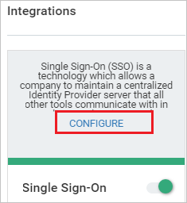

# チュートリアル: Azure AD SSO と Kanbanize の統合

このチュートリアルでは、Kanbanize と Azure Active Directory (Azure AD) を統合する方法について説明します。 Azure AD と Kanbanize を統合すると、次のことができます。

* Kanbanize にアクセスできる Azure AD ユーザーを制御できます。
* ユーザーが自分の Azure AD アカウントを使用して Kanbanize に自動的にサインインできるようにすることができます。
* 1 つの中央サイト (Azure Portal) で自分のアカウントを管理します。

## 前提条件

開始するには、次が必要です。

* Azure AD サブスクリプション。 サブスクリプションがない場合は、[無料アカウント](https://azure.microsoft.com/free/)を取得できます。
* シングル サインオン (SSO) が有効な Kanbanize のサブスクリプション。

## シナリオの説明

このチュートリアルでは、テスト環境で Azure AD の SSO を構成してテストします。

* Kanbanize では、**SP および IDP** Initiated SSO がサポートされます。
* Kanbanize では、**Just In Time** ユーザー プロビジョニングがサポートされます。

## ギャラリーから Kanbanize を追加する

Azure AD への Kanbanize の統合を構成するには、ギャラリーから管理対象 SaaS アプリの一覧に Kanbanize を追加する必要があります。

1. 職場または学校アカウントか、個人の Microsoft アカウントを使用して、Azure portal にサインインします。
1. 左のナビゲーション ウィンドウで **[Azure Active Directory]** サービスを選択します。
1. **[エンタープライズ アプリケーション]** に移動し、 **[すべてのアプリケーション]** を選択します。
1. 新しいアプリケーションを追加するには、 **[新しいアプリケーション]** を選択します。
1. **[ギャラリーから追加する]** セクションで、検索ボックスに「**Kanbanize**」と入力します。
1. 結果のパネルから **[Kanbanize]** を選択し、アプリを追加します。 お使いのテナントにアプリが追加されるのを数秒待機します。

## Kanbanize での Azure AD SSO を構成してテストする

**B.Simon** というテスト ユーザーを使用して、Kanbanize に対する Azure AD SSO を構成してテストします。 SSO が機能するためには、Azure AD ユーザーと Kanbanize の関連ユーザーとの間にリンク関係を確立する必要があります。

Kanbanize での Azure AD SSO を構成してテストするには、次の手順を実行します。

1. **[Azure AD SSO の構成](#configure-azure-ad-sso)** - ユーザーがこの機能を使用できるようにします。
    1. **[Azure AD のテスト ユーザーの作成](#create-an-azure-ad-test-user)** - B.Simon で Azure AD のシングル サインオンをテストします。
    1. **[Azure AD テスト ユーザーの割り当て](#assign-the-azure-ad-test-user)** - B.Simon が Azure AD シングル サインオンを使用できるようにします。
1. **[Kanbanize の SSO の構成](#configure-kanbanize-sso)** - アプリケーション側でシングル サインオン設定を構成します。
    1. **[Kanbanize テスト ユーザーの作成](#create-kanbanize-test-user)** - Azure AD の B.Simon にリンクさせるために、対応するユーザーを Kanbanize で作成します。
1. **[SSO のテスト](#test-sso)** - 構成が機能するかどうかを確認します。

## Azure AD SSO の構成

これらの手順に従って、Azure portal で Azure AD SSO を有効にします。

1. Azure portal の **Kanbanize** アプリケーション統合ページで、 **[管理]** セクションを見つけ、 **[シングル サインオン]** を選択します。
1. **[シングル サインオン方式の選択]** ページで、 **[SAML]** を選択します。
1. **[SAML によるシングル サインオンのセットアップ]** ページで、 **[基本的な SAML 構成]** の鉛筆アイコンをクリックして設定を編集します。

   

1. **[基本的な SAML 構成]** セクションで、アプリケーションを **IDP** 開始モードで構成する場合は、次の手順を実行します。

     a. **[識別子]** ボックスに、`https://<subdomain>.kanbanize.com/` の形式で URL を入力します。

    b. **[応答 URL]** ボックスに、`https://<subdomain>.kanbanize.com/saml/acs` のパターンを使用して URL を入力します

    c. **[追加の URL を設定します]** をクリックします。

    d. **[リレー状態]** ボックスに、値 `/ctrl_login/saml_login` を入力します。

1. アプリケーションを **SP** 開始モードで構成する場合は、 **[追加の URL を設定します]** をクリックして次の手順を実行します。

    **[サインオン URL]** ボックスに、`https://<subdomain>.kanbanize.com` という形式で URL を入力します。

    > [!NOTE]
    > これらは実際の値ではありません。 実際の識別子、応答 URL、サインオン URL でこれらの値を更新します。 これらの値を取得するには、[Kanbanize クライアント サポート チーム](mailto:support@ms.kanbanize.com)に問い合わせてください。 Azure portal の **[基本的な SAML 構成]** セクションに示されているパターンを参照することもできます。

1. Kanbanize アプリケーションは、特定の形式の SAML アサーションを使用するため、カスタム属性のマッピングを SAML トークンの属性の構成に追加する必要があります。 次のスクリーンショットは、既定の属性の一覧を示しています。ここで、nameidentifier は **user.userprincipalname** にマップされています。 Kanbanize アプリケーションでは、nameidentifier が **user.mail** にマップされると想定されているため、[編集] アイコンをクリックして属性マッピングを編集し、属性マッピングを変更する必要があります。

    

1. **[SAML でシングル サインオンをセットアップします]** ページの **[SAML 署名証明書]** セクションで、 **[証明書 (Base64)]** を見つけて、 **[ダウンロード]** を選択し、証明書をダウンロードして、お使いのコンピューターに保存します。

    

1. **[Kanbanize のセットアップ]** セクションで、要件に基づいて適切な URL をコピーします。

    

### Azure AD のテスト ユーザーの作成

このセクションでは、Azure portal 内で B.Simon というテスト ユーザーを作成します。

1. Azure portal の左側のウィンドウから、 **[Azure Active Directory]** 、 **[ユーザー]** 、 **[すべてのユーザー]** の順に選択します。
1. 画面の上部にある **[新しいユーザー]** を選択します。
1. **[ユーザー]** プロパティで、以下の手順を実行します。
   1. **[名前]** フィールドに「`B.Simon`」と入力します。  
   1. **[ユーザー名]** フィールドに「username@companydomain.extension」と入力します。 たとえば、「 `B.Simon@contoso.com` 」のように入力します。
   1. **[パスワードを表示]** チェック ボックスをオンにし、 **[パスワード]** ボックスに表示された値を書き留めます。
   1. **Create** をクリックしてください。

### Azure AD テスト ユーザーの割り当て

このセクションでは、B.Simon に Kanbanize へのアクセスを許可することで、このユーザーが Azure シングル サインオンを使用できるようにします。

1. Azure portal で **[エンタープライズ アプリケーション]** を選択し、 **[すべてのアプリケーション]** を選択します。
1. アプリケーションの一覧で **[Kanbanize]** を選択します。
1. アプリの概要ページで、 **[管理]** セクションを見つけて、 **[ユーザーとグループ]** を選択します。
1. **[ユーザーの追加]** を選択し、 **[割り当ての追加]** ダイアログで **[ユーザーとグループ]** を選択します。
1. **[ユーザーとグループ]** ダイアログの [ユーザー] の一覧から **[B.Simon]** を選択し、画面の下部にある **[選択]** ボタンをクリックします。
1. SAML アサーション内に任意のロール値が必要な場合、 **[ロールの選択]** ダイアログでユーザーに適したロールを一覧から選択し、画面の下部にある **[選択]** をクリックします。
1. **[割り当ての追加]** ダイアログで、 **[割り当て]** をクリックします。

## Kanbanize SSO の構成

1. Kanbanize 内での構成を自動化するには、 **[拡張機能のインストール]** をクリックして **My Apps Secure Sign-in ブラウザー拡張機能** をインストールする必要があります。

    

2. ブラウザーに拡張機能を追加した後、 **[Kanbanize のセットアップ]** をクリックすると、Kanbanize アプリケーションに移動します。 そこから、管理者の資格情報を入力して Kanbanize にサインインします。 ブラウザー拡張機能によりアプリケーションが自動的に構成され、手順 3 ～ 7 が自動化されます。

    

3. Kanbanize を手動でセットアップする場合は、新しい Web ブラウザー ウィンドウを開き、管理者として Kanbanize 企業サイトにサインインして、次の手順を実行します。

4. ページの右上の **設定** ロゴをクリックします。

    

5. [Administration]\(管理\) パネル ページのメニューの左側にある **[Integration]\(統合\)** をクリックし、 **[Single Sign-On]\(シングル サインオン\)** を有効にします。

    ![[Integration]\(統合\) が選択されている [Administration]\(管理\) パネルを示すスクリーンショット。](./media/kanbanize-tutorial/tutorial-kanbanize-admin.png)

6. [Integration]\(統合\) セクションで、 **[CONFIGURE]\(構成\)** をっクリックして **[Single Sign-On Integration]\(シングル サインオンの統合\)** ページを開きます。

    

7. **[Single Sign-On Configuration]\(シングル サインオンの統合\)** ページの **[Configurations]\(構成\)** で、次の手順を実行します。

    ![この手順の値を入力する [Single Sign-On Integration]\(シングル サインオンの統合\) ページを示すスクリーンショット。](./media/kanbanize-tutorial/values.png)

    a. **[Idp Entity ID]\(Idp エンティティ ID\)** ボックスに、Azure portal からコピーした **Azure AD 識別子** の値を貼り付けます。

    b. **[Idp Login Endpoint]\(Idp ログイン エンドポイント\)** テキスト ボックスに、Azure portal からコピーした **ログイン URL** の値を貼り付けます。

    c. **[Idp Logout Endpoint]\(Idp ログアウト エンドポイント\)** テキスト ボックスに、Azure portal からコピーした **ログアウト URL** の値を貼り付けます。

    d. **[Attribute name for Email]\(電子メールの属性名\)** テキストボックスで、この値 `http://schemas.xmlsoap.org/ws/2005/05/identity/claims/emailaddress` を入力します。

    e. **[Attribute name for First Name]\(名の属性名\)** テキストボックスで、この値 `http://schemas.xmlsoap.org/ws/2005/05/identity/claims/givenname` を入力します。

    f. **[Attribute name for Last Name]\(姓の属性名\)** テキストボックスで、この値 `http://schemas.xmlsoap.org/ws/2005/05/identity/claims/surname` を入力します。

    > [!Note]
    > これらの値は、Azure Portal の [ユーザー属性] セクションから対応する名前空間と名前の値を結合することで取得できます。

    g. Azure Portal からダウンロードした Base-64 でエンコードされた証明書をメモ帳で開き、その内容を (開始マーカーとエンド マーカーを除いて) コピーして **[Idp X.509 Certificate]\(IdP X.509 証明書\)** ボックスに貼り付けます。

    h. **[Enable login with both SSO and Kanbanize]\(SSO と Kanbanize の両方でログインを有効にする\)** をオンにします。

    i. **[設定の保存]** をクリックします。

### Kanbanize テスト ユーザーの作成

このセクションでは、B.Simon というユーザーを Kanbanize に作成します。 Kanbanize では、Just-In-Time ユーザー プロビジョニングがサポートされています。この設定は既定で有効になっています。 このセクションでは、ユーザー側で必要な操作はありません。 Kanbanize にユーザーがまだ存在していない場合は、認証後に新しく作成されます。 ユーザーを手動で作成する必要がある場合は、[Kanbanize クライアント サポート チーム](mailto:support@ms.kanbanize.com)にお問い合わせください。

## SSO のテスト 

このセクションでは、次のオプションを使用して Azure AD のシングル サインオン構成をテストします。 

#### SP Initiated:

* Azure portal で **[このアプリケーションをテストします]** をクリックします。 これにより、ログイン フローを開始できる Kanbanize のサインオン URL にリダイレクトされます。  

* Kanbanize のサインオン URL に直接移動し、そこからログイン フローを開始します。

#### IDP Initiated:

* Azure portal で **[このアプリケーションをテストします]** をクリックすると、SSO を設定した Kanbanize に自動的にサインインされます。 

また、Microsoft マイ アプリを使用して、任意のモードでアプリケーションをテストすることもできます。 マイ アプリで [Kanbanize] タイルをクリックすると、SP モードで構成されている場合は、ログイン フローを開始するためのアプリケーション サインオン ページにリダイレクトされます。IDP モードで構成されている場合は、SSO を設定した Kanbanize に自動的にサインインされます。 マイ アプリの詳細については、[マイ アプリの概要](../user-help/my-apps-portal-end-user-access.md)に関するページを参照してください。

## 次のステップ

Kanbanize を構成したら、組織の機密データを流出と侵入からリアルタイムで保護するセッション制御を適用できます。 セッション制御は、条件付きアクセスを拡張したものです。 [Microsoft Defender for Cloud Apps でセッション制御を適用する方法をご覧ください](/cloud-app-security/proxy-deployment-aad)。
