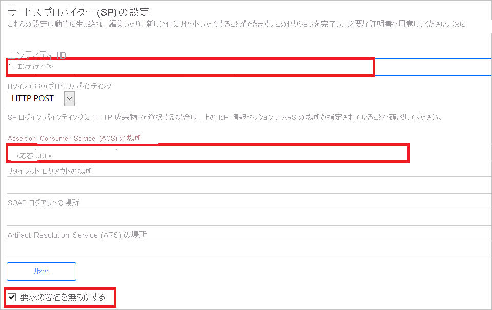

# チュートリアル: Azure AD SSO と Pega Systems の統合

このチュートリアルでは、Pega Systems と Azure Active Directory (Azure AD) を統合する方法について説明します。 Azure AD と Pega Systems を統合すると、次のことができます。

* Pega Systems にアクセスする Azure AD ユーザーを制御できます。
* ユーザーが自分の Azure AD アカウントを使用して Pega Systems に自動的にサインインできるように設定できます。
* 1 つの中央サイト (Azure Portal) で自分のアカウントを管理します。

## 前提条件

開始するには、次が必要です。

* Azure AD サブスクリプション。 サブスクリプションがない場合は、[無料アカウント](https://azure.microsoft.com/free/)を取得できます。
* Pega Systems でのシングル サインオン (SSO) が有効なサブスクリプション。

## シナリオの説明

このチュートリアルでは、テスト環境で Azure AD のシングル サインオンを構成してテストします。

* Pega Systems では、SP と IDP によって開始される SSO がサポートされます。

## ギャラリーからの Pega Systems の追加

Azure AD への Pega Systems の統合を構成するには、ギャラリーから管理対象 SaaS アプリの一覧に Pega Systems を追加する必要があります。

1. 職場または学校アカウントか、個人の Microsoft アカウントを使用して、Azure portal にサインインします。
1. 左のナビゲーション ウィンドウで **[Azure Active Directory]** サービスを選択します。
1. **[エンタープライズ アプリケーション]** に移動し、 **[すべてのアプリケーション]** を選択します。
1. 新しいアプリケーションを追加するには、 **[新しいアプリケーション]** を選択します。
1. **[ギャラリーから追加する]** セクションで、検索ボックスに、「**Pega Systems**」と入力します。
1. 結果のパネルから **[Pega Systems]** を選択し、アプリを追加します。 お使いのテナントにアプリが追加されるのを数秒待機します。

## Pega Systems の Azure AD SSO の構成とテスト

**B.Simon** というテスト ユーザーを使用して、Pega Systems に対する Azure AD SSO を構成してテストします。 SSO が機能するためには、Azure AD ユーザーと Pega Systems の関連ユーザーとの間にリンク関係を確立する必要があります。

Pega Systems に対して Azure AD SSO を構成してテストするには、次の手順を行います。

1. **[Azure AD SSO の構成](#configure-azure-ad-sso)** - ユーザーがこの機能を使用できるようにします。
    1. **[Azure AD のテスト ユーザーの作成](#create-an-azure-ad-test-user)** - B.Simon で Azure AD のシングル サインオンをテストします。
    1. **[Azure AD テスト ユーザーの割り当て](#assign-the-azure-ad-test-user)** - B.Simon が Azure AD シングル サインオンを使用できるようにします。
1. **[Pega Systems の SSO の構成](#configure-pega-systems-sso)** - アプリケーション側でシングル サインオン設定を構成します。
    1. **[Pega Systems テスト ユーザーの作成](#create-pega-systems-test-user)** - Pega Systems で Britta Simon に対応するユーザーを作成し、Azure AD の B.Simon にリンクさせます。
1. **[SSO のテスト](#test-sso)** - 構成が機能するかどうかを確認します。

## Azure AD SSO の構成

これらの手順に従って、Azure portal で Azure AD SSO を有効にします。

1. Azure portal の **Pega Systems** アプリケーション統合ページで、 **[管理]** セクションを見つけて、 **[シングル サインオン]** を選択します。
1. **[シングル サインオン方式の選択]** ページで、 **[SAML]** を選択します。
1. **[SAML によるシングル サインオンのセットアップ]** ページで、 **[基本的な SAML 構成]** の鉛筆アイコンをクリックして設定を編集します。

   

4. **[基本的な SAML 構成]** ダイアログ ボックスで、アプリケーションを IDP 開始モードで構成する場合は、次の手順を実行します。

    1. **[識別子]** ボックスに、次のパターンを使用して URL を入力します。

       `https://<customername>.pegacloud.io:443/prweb/sp/<instanceID>`

    1. **[応答 URL]** ボックスに、 の形式で URL を入力します。

       `https://<customername>.pegacloud.io:443/prweb/PRRestService/WebSSO/SAML/AssertionConsumerService`

5. アプリケーションを SP 開始モードで構成する場合は、 **[追加の URL を設定します]** を選択して次の手順に従います。

    1. **[サインオン URL]** ボックスに、サインオン URL の値を入力します。

    1. **[リレー状態]** ボックスに、次のパターンで URL を入力します。`https://<customername>.pegacloud.io/prweb/sso`

    > [!NOTE]
    > ここに示されている値はプレースホルダーです。 実際の識別子、応答 URL、サインオン URL、リレー状態 URL を使用する必要があります。 このチュートリアルで後述しているように、Pega アプリケーションから、識別子と応答 URL の値を取得することができます。 リレー状態値を取得するには、[Pega Systems のサポート チーム](https://www.pega.com/contact-us)に問い合わせてください。 Azure portal の **[基本的な SAML 構成]** セクションに示されているパターンを参照することもできます。

6. Pega Systems アプリケーションには、特定の形式の SAML アサーションが必要です。 正しい形式のそれらを取得するには、カスタム属性のマッピングを SAML トークンの属性の構成に追加する必要があります。 次のスクリーンショットは、既定の属性を示しています。 **[編集]** アイコンを選択して **[ユーザー属性]** ダイアログ ボックスを開きます。

    ![[User Attributes (ユーザー属性)]](common/edit-attribute.png)

7. 前のスクリーンショットに示されている属性に加えて、Pega Systems アプリケーションでは、いくつかの追加の属性が SAML 応答で返される必要があります。 **[ユーザー属性]** ダイアログ ボックスの **[ユーザー要求]** セクションで、次の手順に従って、以下の SAML トークン属性を追加します。
    
   - `uid`
   - `cn`
   - `mail`
   - `accessgroup`  
   - `organization`  
   - `orgdivision`
   - `orgunit`
   - `workgroup`  
   - `Phone`

    > [!NOTE]
    > これらの値は組織に固有です。 適切な値を指定します。

    1. **[新しい要求の追加]** を選択して **[ユーザー要求の管理]** ダイアログ ボックスを開きます。

    ![[新しい要求の追加] を選択する](common/new-save-attribute.png)

    ![[ユーザー要求の管理] ダイアログ ボックス](common/new-attribute-details.png)

    1. **[名前]** ボックスに、その行に表示される属性名を入力します。

    1. **[名前空間]** ボックスは空白のままにします。

    1. **[ソース]** で **[属性]** を選択します。

    1. **[ソース属性]** の一覧から、その行に表示される属性値を選択します。

    1. **[OK]** を選択します。

    1. **[保存]** を選択します。

8. **[SAML でシングル サインオンをセットアップします]** ページの **[SAML 署名証明書]** セクションで、実際の要件に従って、 **[フェデレーション メタデータ XML]** の横にある **[ダウンロード]** リンクを選択し、証明書を自分のコンピューターに保存します。

    

9. **[Pega Systems のセットアップ]** セクションで、要件に基づいて適切な URL をコピーします。

    

### Azure AD のテスト ユーザーの作成

このセクションでは、Azure portal 内で B.Simon というテスト ユーザーを作成します。

1. Azure portal の左側のウィンドウから、 **[Azure Active Directory]** 、 **[ユーザー]** 、 **[すべてのユーザー]** の順に選択します。
1. 画面の上部にある **[新しいユーザー]** を選択します。
1. **[ユーザー]** プロパティで、以下の手順を実行します。
   1. **[名前]** フィールドに「`B.Simon`」と入力します。  
   1. **[ユーザー名]** フィールドに「username@companydomain.extension」と入力します。 たとえば、「 `B.Simon@contoso.com` 」のように入力します。
   1. **[パスワードを表示]** チェック ボックスをオンにし、 **[パスワード]** ボックスに表示された値を書き留めます。
   1. **Create** をクリックしてください。

### Azure AD テスト ユーザーの割り当て

このセクションでは、B. Simon に Pega Systems へのアクセスを許可することで、このユーザーが Azure シングル サインオンを使用できるようにします。

1. Azure portal で **[エンタープライズ アプリケーション]** を選択し、 **[すべてのアプリケーション]** を選択します。
1. アプリケーションの一覧で **[Pega Systems]** を選択します。
1. アプリの概要ページで、 **[管理]** セクションを見つけて、 **[ユーザーとグループ]** を選択します。
1. **[ユーザーの追加]** を選択し、 **[割り当ての追加]** ダイアログで **[ユーザーとグループ]** を選択します。
1. **[ユーザーとグループ]** ダイアログの [ユーザー] の一覧から **[B.Simon]** を選択し、画面の下部にある **[選択]** ボタンをクリックします。
1. ユーザーにロールが割り当てられることが想定される場合は、 **[ロールの選択]** ドロップダウンからそれを選択できます。 このアプリに対してロールが設定されていない場合は、[既定のアクセス] ロールが選択されていることを確認します。
1. **[割り当ての追加]** ダイアログで、 **[割り当て]** をクリックします。

## Pega Systems の SSO の構成

1. **Pega Systems** 側でシングル サインオンを構成するには、別のブラウザー ウィンドウで管理者アカウントを使って Pega ポータルにサインインします。

1. **[Create]\(作成\)**  >  **[SysAdmin]**  >  **[Authentication Service]\(認証サービス\)** の順に選択します。

    ![[Authentication Service]\(認証サービス\) を選択する](./media/pegasystems-tutorial/admin.png)
    
1. **[Create Authentication Service]\(認証サービスの作成\)** 画面で、次の手順を実行します。

    ![[Create Authentication Service]\(認証サービスの作成\) 画面](./media/pegasystems-tutorial/service.png)

    1. **[Type]\(種類\)** ドロップダウン リストで、 **[SAML 2.0]** を選択します。

    1. **[Name]\(名前\)** ボックスに名前を入力します (例: **Azure AD SSO**)。

    1. **[Short Description]\(簡単な説明\)** ボックスに、任意の説明を入力します。  

    1. **[Create and open]\(作成して開く\)** を選択します。
    
1. **[Identity Provider (IdP) information]\(ID プロバイダー (IdP) 情報\)** セクションで **[Import IdP metadata]\(IdP メタデータのインポート\)** を選択し、Azure portal からダウンロードしたメタデータ ファイルを参照します。 **[Submit]\(送信\)** をクリックして、メタデータを読み込みます。

    
    
    インポートによって、次に示すように、IdP データが設定されます。

    
    
1. **[Service Provider (SP) settings]\(サービス プロバイダー (SP) 設定\)** セクションで、以下の手順を行います。

    

    1. **[Entity Identification]\(エンティティ ID\)** の値をコピーして、Azure portal の **[基本的な SAML 構成]** セクションにある **[識別子]** ボックスに貼り付けます。

    1. **[Assertion Consumer Service (ACS) location]\(アサーション コンシューマー サービス (ACS) の場所\)** の値をコピーして、Azure portal の **[基本的な SAML 構成]** セクションにある **[返信 URL]** ボックスに貼り付けます。

    1. **[Disable request signing]\(要求署名を無効にする\)** をオンにします。

1. **[保存]** を選択します。

### Pega Systems テスト ユーザーの作成

次に、Pega Systems で Britta Simon というユーザーを作成する必要があります。 [Pega Systems サポート チーム](https://www.pega.com/contact-us)と協力して、ユーザーを作成します。

## SSO のテスト

このセクションでは、次のオプションを使用して Azure AD のシングル サインオン構成をテストします。 

#### SP Initiated:

* Azure portal で **[このアプリケーションをテストします]** をクリックします。 これにより、ログイン フローを開始できる Pega Systems のサインオン URL にリダイレクトされます。  

* Pega Systems のサインオン URL に直接移動し、そこからログイン フローを開始します。

#### IDP Initiated:

* Azure portal で **[このアプリケーションをテストします]** をクリックすると、SSO を設定した Pega Systems に自動的にサインインされます。 

また、Microsoft マイ アプリを使用して、任意のモードでアプリケーションをテストすることもできます。 マイ アプリで [Pega Systems] タイルをクリックすると、SP モードで構成されている場合は、ログイン フローを開始するためのアプリケーション サインオン ページにリダイレクトされます。IDP モードで構成されている場合は、SSO を設定した Pega Systems に自動的にサインインされます。 マイ アプリの詳細については、[マイ アプリの概要](https://support.microsoft.com/account-billing/sign-in-and-start-apps-from-the-my-apps-portal-2f3b1bae-0e5a-4a86-a33e-876fbd2a4510)に関するページを参照してください。

## 次のステップ

Pega Systems を構成したら、組織の機密データを流出と侵入からリアルタイムで保護するセッション制御を適用することができます。 セッション制御は、条件付きアクセスを拡張したものです。 [Microsoft Defender for Cloud Apps でセッション制御を強制する方法](/cloud-app-security/proxy-deployment-aad)をご覧ください。
