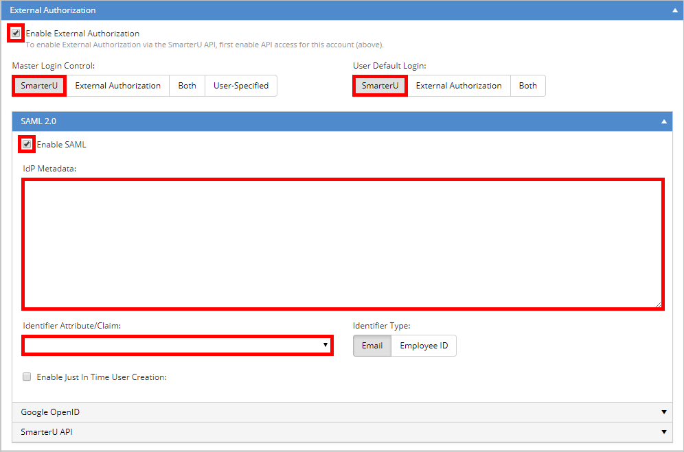

# チュートリアル:Azure Active Directory と SmarterU の統合

> [!NOTE]
> SmarterU を Azure Active Directory に統合するプロセスは、[SmarterU のヘルプ システム](https://help.smarteru.com/ID2053086)でも文書化され、整備されています。

このチュートリアルでは、SmarterU と Azure Active Directory (Azure AD) を統合する方法について説明します。 SmarterU と Azure AD を統合すると、次のことが可能になります。

* SmarterU にアクセスするユーザーを Azure AD で制御します。
* ユーザーが自分の Azure AD アカウントを使用して SmarterU に自動的にサインインできるように設定します。
* 1 つの中央サイト (Azure Portal) で自分のアカウントを管理します。

## 前提条件

開始するには、次が必要です。

* Azure AD サブスクリプション。 サブスクリプションがない場合は、[無料アカウント](https://azure.microsoft.com/free/)を取得できます。
* SmarterU でのシングル サインオン (SSO) が有効なサブスクリプション。

## シナリオの説明

このチュートリアルでは、テスト環境で Azure AD のシングル サインオンを構成してテストします。

* SmarterU では、**IDP** Initiated SSO がサポートされます。

> [!NOTE]
> このアプリケーションの識別子は固定文字列値であるため、1 つのテナントで構成できるインスタンスは 1 つだけです。

## ギャラリーからの SmarterU の追加

Azure AD への SmarterU の統合を構成するには、ギャラリーから管理対象 SaaS アプリの一覧に SmarterU を追加する必要があります。

1. 職場または学校アカウントか、個人の Microsoft アカウントを使用して、Azure portal にサインインします。
1. 左のナビゲーション ウィンドウで **[Azure Active Directory]** サービスを選択します。
1. **[エンタープライズ アプリケーション]** に移動し、 **[すべてのアプリケーション]** を選択します。
1. 新しいアプリケーションを追加するには、 **[新しいアプリケーション]** を選択します。
1. **[ギャラリーから追加する]** セクションで、検索ボックスに「**SmarterU**」と入力します。
1. 結果のパネルから **[SmarterU]** を選択し、アプリを追加します。 お使いのテナントにアプリが追加されるのを数秒待機します。

## SmarterU のための Azure AD SSO の構成とテスト

**B.Simon** というテスト ユーザーを使用して、 SmarterU 用に Azure AD SSO を構成してテストします。 SSO を機能させるには、Azure AD ユーザーと SmarterU の関連ユーザーとの間にリンク関係を確立する必要があります。

SmarterU 用に Azure AD SSO を構成してテストするには、次の手順を行います。

1. **[Azure AD SSO の構成](#configure-azure-ad-sso)** - ユーザーがこの機能を使用できるようにします。
    1. **[Azure AD のテスト ユーザーの作成](#create-an-azure-ad-test-user)** - B.Simon で Azure AD のシングル サインオンをテストします。
    1. **[Azure AD テスト ユーザーの割り当て](#assign-the-azure-ad-test-user)** - B.Simon が Azure AD シングル サインオンを使用できるようにします。
1. **[SmarterU の SSO の構成](#configure-smarteru-sso)** - アプリケーション側でシングル サインオン設定を構成します。
    1. **[SmarterU テスト ユーザーの作成](#create-smarteru-test-user)** - SmarterU で B.Simon に対応するユーザーを作成し、Azure AD のこのユーザーにリンクさせます。
1. **[SSO のテスト](#test-sso)** - 構成が機能するかどうかを確認します。

## Azure AD SSO の構成

これらの手順に従って、Azure portal で Azure AD SSO を有効にします。

1. Azure portal の **SmarterU** アプリケーション統合ページで、 **[管理]** セクションを見つけて、 **[シングル サイン オン]** を選択します。
1. **[シングル サインオン方式の選択]** ページで、 **[SAML]** を選択します。
1. **[SAML によるシングル サインオンのセットアップ]** ページで、 **[基本的な SAML 構成]** の鉛筆アイコンをクリックして設定を編集します。

   

4. **[基本的な SAML 構成]** セクションで、次の手順を実行します。

    **[識別子]** ボックスに、`https://www.smarteru.com/` という URL を入力します。

5. **[SAML でシングル サインオンをセットアップします]** ページの **[SAML 署名証明書]** セクションで、 **[ダウンロード]** をクリックして、要件のとおりに指定したオプションから **フェデレーション メタデータ XML** をダウンロードして、お使いのコンピューターに保存します。

    

6. **[SmarterU のセットアップ]** セクションで、要件に従って適切な URL をコピーします。

    

### Azure AD のテスト ユーザーの作成

このセクションでは、Azure portal 内で B.Simon というテスト ユーザーを作成します。

1. Azure portal の左側のウィンドウから、 **[Azure Active Directory]** 、 **[ユーザー]** 、 **[すべてのユーザー]** の順に選択します。
1. 画面の上部にある **[新しいユーザー]** を選択します。
1. **[ユーザー]** プロパティで、以下の手順を実行します。
   1. **[名前]** フィールドに「`B.Simon`」と入力します。  
   1. **[ユーザー名]** フィールドに「username@companydomain.extension」と入力します。 たとえば、「 `B.Simon@contoso.com` 」のように入力します。
   1. **[パスワードを表示]** チェック ボックスをオンにし、 **[パスワード]** ボックスに表示された値を書き留めます。
   1. **Create** をクリックしてください。

### Azure AD テスト ユーザーの割り当て

このセクションでは、B.Simon に SmarterU へのアクセスを許可することで、このユーザーが Azure シングル サインオンを使用できるようにします。

1. Azure portal で **[エンタープライズ アプリケーション]** を選択し、 **[すべてのアプリケーション]** を選択します。
1. アプリケーションの一覧で **[SmarterU]** を選択します。
1. アプリの概要ページで、 **[管理]** セクションを見つけて、 **[ユーザーとグループ]** を選択します。
1. **[ユーザーの追加]** を選択し、 **[割り当ての追加]** ダイアログで **[ユーザーとグループ]** を選択します。
1. **[ユーザーとグループ]** ダイアログの [ユーザー] の一覧から **[B.Simon]** を選択し、画面の下部にある **[選択]** ボタンをクリックします。
1. ユーザーにロールが割り当てられることが想定される場合は、 **[ロールの選択]** ドロップダウンからそれを選択できます。 このアプリに対してロールが設定されていない場合は、[既定のアクセス] ロールが選択されていることを確認します。
1. **[割り当ての追加]** ダイアログで、 **[割り当て]** をクリックします。

## SmarterU の SSOの構成

1. 別の Web ブラウザー ウィンドウで、SmarterU 企業サイトに管理者としてサインインします。

1. 上部のメニューで **[Account Settings]** をクリックします。

    ![[Account Settings]](./media/smarteru-tutorial/settings.png)

1. アカウント構成ページで、次の手順に従います。

     

    a. **[Enable External Authorization]** を選択します。
  
    b. **[Master Login Control]** セクションで、 **[SmarterU]** タブを選択します。
  
    c. **[User Default Login]** セクションで、 **[SmarterU]** タブを選択します。
  
    d. **[Enable SAML]** を選択します。
  
    e. ダウンロードしたメタデータ ファイルの内容をコピーし、 **[IdP Metadata]\(IdP メタデータ\)** テキスト ボックスに貼り付けます。

    f. **[Identifier Attribute/Claim]\(識別子属性\要求)** を選択します。
  
    g. **[保存]** をクリックします。

### SmarterU テスト ユーザーの作成

Azure AD ユーザーが SmarterU にサインインできるようにするには、そのユーザーを SmarterU にプロビジョニングする必要があります。 SmarterU の場合、プロビジョニングは手動で行います。

**ユーザー アカウントをプロビジョニングするには、次の手順に従います。**

1. **SmarterU** テナントにサインインします。

1. **[Users]** タブに移動します。

1. ユーザー セクションで、次の手順に従います。

    ![[新しいユーザー]](./media/smarteru-tutorial/add-user.png)  

    a. **[+User]** をクリックします。

    b. Azure AD のユーザー アカウントに関連する属性の値を次のテキスト ボックスに入力します。 **[Primary Email]** 、 **[Employee ID]** 、 **[Password]** 、 **[Verify Password]** 、 **[Given Name]** 、 **[Surname]** 。

    c. **[Active]** をクリックします。

    d. **[保存]** をクリックします。

> [!NOTE]
> 他の SmarterU ユーザー アカウント作成ツールや、SmarterU から提供されている API を使用して、Azure AD ユーザー アカウントをプロビジョニングできます。

## SSO のテスト

このセクションでは、次のオプションを使用して Azure AD のシングル サインオン構成をテストします。

* Azure portal で [このアプリケーションをテストします] をクリックすると、SSO を設定した SmarterU に自動的にサインインされます。

* Microsoft マイ アプリを使用することができます。 マイ アプリで [SmarterU] タイルをクリックすると、SSO を設定した SmarterU に自動的にサインインされます。 マイ アプリの詳細については、[マイ アプリの概要](https://support.microsoft.com/account-billing/sign-in-and-start-apps-from-the-my-apps-portal-2f3b1bae-0e5a-4a86-a33e-876fbd2a4510)に関するページを参照してください。

## 次のステップ

SmarterU を構成したら、組織の機密データの流出と侵入をリアルタイムで保護するセッション制御を適用することができます。 セッション制御は、条件付きアクセスを拡張したものです。 [Microsoft Defender for Cloud Apps でセッション制御を強制する方法](/cloud-app-security/proxy-deployment-aad)をご覧ください。
