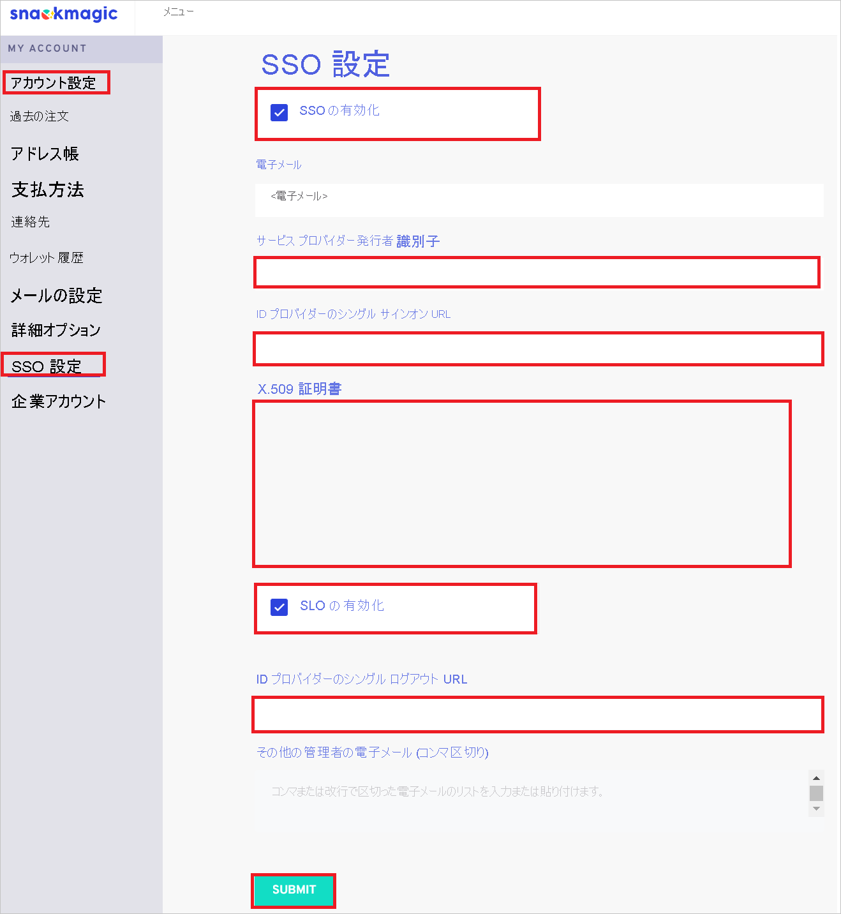

# チュートリアル: Azure AD SSO と Snackmagic の統合

このチュートリアルでは、Snackmagic と Azure Active Directory (Azure AD) を統合する方法について説明します。 Azure AD と Snackmagic を統合すると、次のことができます。

* Snackmagic にアクセスする Azure AD ユーザーを制御できます。
* ユーザーが自分の Azure AD アカウントを使用して Snackmagic に自動的にサインインできるように設定できます。
* 1 つの中央サイト (Azure Portal) で自分のアカウントを管理します。

## 前提条件

開始するには、次が必要です。

* Azure AD サブスクリプション。 サブスクリプションがない場合は、[無料アカウント](https://azure.microsoft.com/free/)を取得できます。
* Snackmagic でのシングル サインオン (SSO) が有効なサブスクリプション。

## シナリオの説明

このチュートリアルでは、テスト環境で Azure AD の SSO を構成してテストします。

* Snackmagic では、**SP と IDP** によって開始される SSO がサポートされます。
* Snackmagic では、**Just-In-Time** ユーザー プロビジョニングがサポートされます。

> [!NOTE]
> このアプリケーションの識別子は固定文字列値であるため、1 つのテナントで構成できるインスタンスは 1 つだけです。

## ギャラリーからの Snackmagic の追加

Azure AD への Snackmagic の統合を構成するには、ギャラリーから管理対象 SaaS アプリの一覧に Snackmagic を追加する必要があります。

1. 職場または学校アカウントか、個人の Microsoft アカウントを使用して、Azure portal にサインインします。
1. 左のナビゲーション ウィンドウで **[Azure Active Directory]** サービスを選択します。
1. **[エンタープライズ アプリケーション]** に移動し、 **[すべてのアプリケーション]** を選択します。
1. 新しいアプリケーションを追加するには、 **[新しいアプリケーション]** を選択します。
1. **[ギャラリーから追加する]** セクションで、検索ボックスに「**Snackmagic**」と入力します。
1. 結果のパネルから **[Snackmagic]** を選択し、アプリを追加します。 お使いのテナントにアプリが追加されるのを数秒待機します。

## Snackmagic の Azure AD SSO の構成とテスト

**B.Simon** というテスト ユーザーを使用して、Snackmagic に対する Azure AD SSO を構成してテストします。 SSO を機能させるには、Azure AD ユーザーと Snackmagic の関連ユーザーとの間にリンク関係を確立する必要があります。

Snackmagic に対する Azure AD SSO を構成してテストするには、次の手順を実行します。

1. **[Azure AD SSO の構成](#configure-azure-ad-sso)** - ユーザーがこの機能を使用できるようにします。
    1. **[Azure AD のテスト ユーザーの作成](#create-an-azure-ad-test-user)** - B.Simon で Azure AD のシングル サインオンをテストします。
    1. **[Azure AD テスト ユーザーの割り当て](#assign-the-azure-ad-test-user)** - B.Simon が Azure AD シングル サインオンを使用できるようにします。
1. **[Snackmagic の SSO の構成](#configure-snackmagic-sso)** - アプリケーション側でシングル サインオン設定を構成します。
    1. **[Snackmagic テスト ユーザーの作成](#create-snackmagic-test-user)** - SeisSnackmagic で B.Simon に対応するユーザーを作成し、Azure AD のこのユーザーにリンクさせます。
1. **[SSO のテスト](#test-sso)** - 構成が機能するかどうかを確認します。

## Azure AD SSO の構成

これらの手順に従って、Azure portal で Azure AD SSO を有効にします。

1. Azure portal の **Snackmagic** アプリケーション統合ページで、 **[管理]** セクションを見つけて、 **[シングル サインオン]** を選択します。
1. **[シングル サインオン方式の選択]** ページで、 **[SAML]** を選択します。
1. **[SAML によるシングル サインオンのセットアップ]** ページで、 **[基本的な SAML 構成]** の鉛筆アイコンをクリックして設定を編集します。

   

1. **[基本的な SAML 構成]** セクションで、次の手順を実行します。

    a. **[リレー状態]** ボックスに、URL `https://www.snackmagic.com/` を入力します

    b. **[ログアウト URL]** テキスト ボックスに、次の URL を入力します。`https://sso.snackmagic.com/slo/callback`

1. アプリケーションを **SP** 開始モードで構成する場合は、 **[追加の URL を設定します]** をクリックして次の手順を実行します。

    a. **[サインオン URL]** テキスト ボックスに、URL として「`https://www.snackmagic.com/?modal=login`」と入力します。

1. **[保存]** をクリックします。

1. Snackmagic アプリケーションは、特定の形式の SAML アサーションを使用するため、カスタム属性マッピングを SAML トークンの属性の構成に追加する必要があります。 次のスクリーンショットには、既定の属性一覧が示されています。

    

1. その他に、Snackmagic アプリケーションでは、いくつかの属性が SAML 応答で返されることが想定されています。それらの属性を次に示します。 これらの属性も値が事前に設定されますが、要件に従ってそれらの値を確認することができます。
    
    | 名前 | ソース属性|
    | --------| --------- |
    | firstName | User.givenname |
    | lastName | User.surname |
    | company | user.companyname |
    | phone | user.telephonenumber |
    | email | user.userprincipalname |

1. **[SAML でシングル サインオンをセットアップします]** ページの **[SAML 署名証明書]** セクションで、 **[証明書 (Base64)]** を見つけて、 **[ダウンロード]** を選択し、証明書をダウンロードして、お使いのコンピューターに保存します。

    

1. **[Snackmagic のセットアップ]** セクションで、要件に基づいて適切な URL をコピーします。

    

### Azure AD のテスト ユーザーの作成

このセクションでは、Azure portal 内で B.Simon というテスト ユーザーを作成します。

1. Azure portal の左側のウィンドウから、 **[Azure Active Directory]** 、 **[ユーザー]** 、 **[すべてのユーザー]** の順に選択します。
1. 画面の上部にある **[新しいユーザー]** を選択します。
1. **[ユーザー]** プロパティで、以下の手順を実行します。
   1. **[名前]** フィールドに「`B.Simon`」と入力します。  
   1. **[ユーザー名]** フィールドに「username@companydomain.extension」と入力します。 たとえば、「 `B.Simon@contoso.com` 」のように入力します。
   1. **[パスワードを表示]** チェック ボックスをオンにし、 **[パスワード]** ボックスに表示された値を書き留めます。
   1. **Create** をクリックしてください。

### Azure AD テスト ユーザーの割り当て

このセクションでは、B.Simon に Snackmagic へのアクセスを許可することで、このユーザーが Azure シングル サインオンを使用できるようにします。

1. Azure portal で **[エンタープライズ アプリケーション]** を選択し、 **[すべてのアプリケーション]** を選択します。
1. アプリケーションの一覧で **[Snackmagic]** を選択します。
1. アプリの概要ページで、 **[管理]** セクションを見つけて、 **[ユーザーとグループ]** を選択します。
1. **[ユーザーの追加]** を選択し、 **[割り当ての追加]** ダイアログで **[ユーザーとグループ]** を選択します。
1. **[ユーザーとグループ]** ダイアログの [ユーザー] の一覧から **[B.Simon]** を選択し、画面の下部にある **[選択]** ボタンをクリックします。
1. ユーザーにロールが割り当てられることが想定される場合は、 **[ロールの選択]** ドロップダウンからそれを選択できます。 このアプリに対してロールが設定されていない場合は、[既定のアクセス] ロールが選択されていることを確認します。
1. **[割り当ての追加]** ダイアログで、 **[割り当て]** をクリックします。

## Snackmagic SSO の構成

1. Snackmagic 企業サイトに管理者としてログインします。

1. **[Account Settings]\(アカウントの設定\)**  >  **[SSO Preferences]\(SSO 設定\)** の順に移動し、次の手順を実行します。

    

    1. **[Enable SSO]\(SSO を有効にする\)** チェックボックスをオンにします。

    1. **[Service Provider Issuer/Identifier]\(サービス プロバイダー発行者/ID\)** テキストボックスに、Azure portal からコピーした **識別子 URL** の値を貼り付けます。

    1. **[ID プロバイダー のシングル サインオン URL]** テキストボックスに、Azure portal からコピーした **ログイン URL** の値を貼り付けます。

    1. Azure portal からダウンロードした **証明書 (Base64)** をメモ帳で開き、その内容を **[X.509 Certificate]\(X.509 証明書\)** ボックスに貼り付けます。

    1. **[Enable SLO]\(SLO を有効にする\)** チェックボックスをオンにします。

    1. **[Identity Provider Single Logout URL]\(ID プロバイダー シングル ログアウト URL\)** ボックスに、Azure portal からコピーした **ログアウト URL** の値を貼り付けます。

    1. **[SUBMIT]\(送信\)** をクリックします。

### Snackmagic のテスト ユーザーの作成

このセクションでは、Britta Simon というユーザーを Snackmagic に作成します。 Snackmagic では、Just-In-Time ユーザー プロビジョニングがサポートされています。これは既定で有効になっています。 このセクションでは、ユーザー側で必要な操作はありません。 Snackmagic にユーザーがまだ存在していない場合は、認証後に新規作成されます。

## SSO のテスト 

このセクションでは、次のオプションを使用して Azure AD のシングル サインオン構成をテストします。 

#### SP Initiated:

* Azure portal で **[このアプリケーションをテストします]** をクリックします。 これにより、Snackmagic のサインオン URL にリダイレクトされ、そこでログイン フローを開始できます。  

* Snackmagic のサインオン URL に直接移動し、そこからログイン フローを開始します。

#### IDP Initiated:

* Azure portal で **[このアプリケーションをテストします]** をクリックすると、SSO を設定した Snackmagic に自動的にサインインされます。 

また、Microsoft マイ アプリを使用して、任意のモードでアプリケーションをテストすることもできます。 マイ アプリで [Snackmagic] タイルをクリックすると、SP モードで構成されている場合は、ログイン フローを開始するためのアプリケーション サインオン ページにリダイレクトされます。IDP モードで構成されている場合は、SSO を設定した Snackmagic に自動的にサインインされます。 マイ アプリの詳細については、[マイ アプリの概要](../user-help/my-apps-portal-end-user-access.md)に関するページを参照してください。

## 次のステップ

Snackmagic を構成したら、組織の機密データを流出と侵入からリアルタイムで保護するセッション制御を適用できます。 セッション制御は、条件付きアクセスを拡張したものです。 [Microsoft Defender for Cloud Apps でセッション制御を適用する方法をご覧ください](/cloud-app-security/proxy-deployment-aad)。
