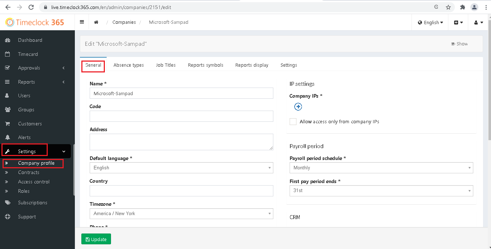

# チュートリアル: TimeClock 365 を構成し、自動ユーザー プロビジョニングに対応させる

このチュートリアルでは、自動ユーザー プロビジョニングを構成するために TimeClock 365 と Azure Active Directory (Azure AD) の両方で実行する必要がある手順について説明します。 構成すると、Azure AD による Azure AD プロビジョニング サービスを使用した [TimeClock 365](https://timeclock365.com/) へのユーザーとグループのプロビジョニングとプロビジョニング解除が自動的に行われます。 このサービスが実行する内容、しくみ、よく寄せられる質問の重要な詳細については、「[Azure Active Directory による SaaS アプリへのユーザー プロビジョニングとプロビジョニング解除の自動化](../app-provisioning/user-provisioning.md)」を参照してください。 

## サポートされる機能
> [!div class="checklist"]
> * TimeClock 365 でユーザーを作成する
> * アクセスが不要になった TimeClock 365 のユーザーを削除する
> * Azure AD と TimeClock 365 の間でユーザー属性の同期を維持する
> * TimeClock 365 への[シングル サインオン](../manage-apps/add-application-portal-setup-oidc-sso.md) (推奨)。

## 前提条件

このチュートリアルで説明するシナリオでは、次の前提条件目があることを前提としています。

* [Azure AD テナント](../develop/quickstart-create-new-tenant.md) 
* プロビジョニングを構成するための[アクセス許可](../roles/permissions-reference.md)を持つ Azure AD のユーザー アカウント (アプリケーション管理者、クラウド アプリケーション管理者、アプリケーション所有者、グローバル管理者など)。 
* [TimeClock 365](https://timeclock365.com/) テナント。
* 管理者アクセス許可がある TimeClock 365 のユーザー アカウント。

## 手順 1. プロビジョニングのデプロイを計画する
1. [プロビジョニング サービスのしくみ](../app-provisioning/user-provisioning.md)を確認します。
1. [プロビジョニングの対象](../app-provisioning/define-conditional-rules-for-provisioning-user-accounts.md)となるユーザーを決定します。
1. [Azure AD と TimeClock 365 の間でマップする](../app-provisioning/customize-application-attributes.md)データを決定します。 

## 手順 2. Azure AD によるプロビジョニングをサポートするように TimeClock 365 を構成する

1. [Timeclock365 管理コンソール](https://live.timeclock365.com) にログインします。

1. **[Settings]\(設定\) > [Company profile]\(会社のプロファイル\) > [General]\(全般\)** に移動します。

    

1. **[Azure user synchronization] \(Azure のユーザー同期\)** まで下にスクロールします。**Azure AD トークン** をコピーして保存します。 この値を、Azure portal 上で TimeClock 365 アプリケーションの [プロビジョニング] タブ内の **[シークレット トークン]** フィールドに入力します。 

    

1. `https://live.timeclock365.com/scim` を、Azure portal で TimeClock 365 アプリケーションの [プロビジョニング] タブ内にある **[テナント URL]** フィールドに入力します。

## 手順 3. Azure AD アプリケーション ギャラリーから TimeClock 365 を追加する

Azure AD アプリケーション ギャラリーから TimeClock 365 を追加して、TimeClock 365 へのプロビジョニングの管理を開始します。 SSO のために TimeClock 365 を以前に設定している場合は、その同じアプリケーションを使用できます。 ただし、統合を初めてテストするときは、別のアプリを作成することをお勧めします。 ギャラリーからアプリケーションを追加する方法の詳細については、[こちら](../manage-apps/add-application-portal.md)を参照してください。 

## 手順 4. プロビジョニングの対象となるユーザーを定義する 

Azure AD プロビジョニング サービスを使用すると、アプリケーションへの割り当て、ユーザーまたはグループの属性に基づいてプロビジョニングされるユーザーのスコープを設定できます。 割り当てに基づいてアプリにプロビジョニングされるユーザーのスコープを設定する場合、以下の[手順](../manage-apps/assign-user-or-group-access-portal.md)を使用して、ユーザーとグループをアプリケーションに割り当てることができます。 ユーザーまたはグループの属性のみに基づいてプロビジョニングされるユーザーのスコープを設定する場合、[こちら](../app-provisioning/define-conditional-rules-for-provisioning-user-accounts.md)で説明されているスコープ フィルターを使用できます。 

* TimeClock 365 にユーザーとグループを割り当てる場合は、**既定のアクセス** 以外のロールを選択する必要があります。 既定のアクセス ロールを持つユーザーは、プロビジョニングから除外され、プロビジョニング ログで実質的に資格がないとマークされます。 アプリケーションで使用できる唯一のロールが既定のアクセス ロールである場合は、[アプリケーション マニフェストを更新](../develop/howto-add-app-roles-in-azure-ad-apps.md)してロールを追加することができます。 

* 小さいところから始めましょう。 全員にロールアウトする前に、少数のユーザーとグループでテストします。 プロビジョニングのスコープが割り当て済みユーザーとグループに設定される場合、これを制御するには、1 つまたは 2 つのユーザーまたはグループをアプリに割り当てます。 スコープがすべてのユーザーとグループに設定されている場合は、[属性ベースのスコープ フィルター](../app-provisioning/define-conditional-rules-for-provisioning-user-accounts.md)を指定できます。 

## 手順 5. TimeClock 365 への自動ユーザー プロビジョニングを構成する 

このセクションでは、Azure AD プロビジョニング サービスを構成し、Azure AD でのユーザーやグループの割り当てに基づいて TimeClock 365 のユーザーやグループを作成、更新、無効化する手順について説明します。

### Azure AD で TimeClock 365 の自動ユーザー プロビジョニングを構成するには、次の手順に従います。

1. [Azure portal](https://portal.azure.com) にサインインします。 **[エンタープライズ アプリケーション]** を選択し、 **[すべてのアプリケーション]** を選択します。

    ![[エンタープライズ アプリケーション] ブレード](common/enterprise-applications.png)

1. アプリケーションの一覧で **[Timeclock 365]** を選択します。

    

1. **[プロビジョニング]** タブを選択します。

    ![[プロビジョニング] タブ](common/provisioning.png)

1. **[プロビジョニング モード]** を **[自動]** に設定します。

    ![[プロビジョニング] タブの [自動]](common/provisioning-automatic.png)

1. **[管理者資格情報]** セクションで、TimeClock 365 の **[テナントの URL]** と **[シークレット トークン]** を入力します。 **[テスト接続]** をクリックして、Azure AD から TimeClock 365 への接続を確認します。 接続できない場合は、使用している TimeClock 365 アカウントに管理者アクセス許可があることを確認してから、もう一度試します。

    

1. **[通知用メール]** フィールドに、プロビジョニングのエラー通知を受け取るユーザーまたはグループの電子メール アドレスを入力して、 **[エラーが発生したときにメール通知を送信します]** チェック ボックスをオンにします。

    

1. **[保存]** を選択します。

1. **[マッピング]** セクションで、 **[Synchronize Azure Active Directory Users to TimeClock 365]\(Azure Active Directory ユーザーを TimeClock 365 に同期する\)** を選択します。

1. **[属性マッピング]** セクションで、Azure AD から TimeClock 365 に同期されるユーザー属性を確認します。 **[Matching]\(照合\)** プロパティとして選択されている属性は、更新処理で TimeClock 365 のユーザー アカウントとの照合に使用されます。 [照合する対象の属性](../app-provisioning/customize-application-attributes.md)を変更する場合は、その属性に基づいたユーザーのフィルター処理が TimeClock 365 API で確実にサポートされている必要があります。 **[保存]** ボタンをクリックして変更をコミットします。

   |属性|Type|フィルター処理のサポート|
   |---|---|---|
   |userName|String|&check;
   |active|Boolean|
   |displayName|String|   
   |emails[type eq "work"].value|String|
   |externalId|String|
   |urn:ietf:params:scim:schemas:extension:enterprise:2.0:User:employeeNumber|String|
   |urn:ietf:params:scim:schemas:extension:enterprise:2.0:User:manager|String|
   
1. スコープ フィルターを構成するには、[スコープ フィルターのチュートリアル](../app-provisioning/define-conditional-rules-for-provisioning-user-accounts.md)の次の手順を参照してください。

1. TimeClock 365 に対して Azure AD プロビジョニング サービスを有効にするには、 **[設定]** セクションで **[プロビジョニング状態]** を **[オン]** に変更します。

    ![プロビジョニングの状態を [オン] に切り替える](common/provisioning-toggle-on.png)

1. **[設定]** セクションの **[スコープ]** で目的の値を選択して、TimeClock 365 にプロビジョニングするユーザーやグループを定義します。

    

1. プロビジョニングの準備ができたら、 **[保存]** をクリックします。

    

この操作により、 **[設定]** セクションの **[スコープ]** で定義したすべてのユーザーとグループの初期同期サイクルが開始されます。 初期サイクルは後続の同期よりも実行に時間がかかります。後続のサイクルは、Azure AD のプロビジョニング サービスが実行されている限り約 40 分ごとに実行されます。 

## 手順 6. デプロイを監視する
プロビジョニングを構成したら、次のリソースを使用してデプロイを監視します。

* [プロビジョニング ログ](../reports-monitoring/concept-provisioning-logs.md)を使用して、正常にプロビジョニングされたユーザーと失敗したユーザーを特定します。
* [進行状況バー](../app-provisioning/application-provisioning-when-will-provisioning-finish-specific-user.md)を確認して、プロビジョニング サイクルの状態と完了までの時間を確認します。
* プロビジョニング構成が異常な状態になったと考えられる場合、アプリケーションは検疫されます。 検疫状態の詳細については、[こちら](../app-provisioning/application-provisioning-quarantine-status.md)を参照してください。  

## その他のリソース

* [エンタープライズ アプリのユーザー アカウント プロビジョニングの管理](../app-provisioning/configure-automatic-user-provisioning-portal.md)
* [Azure Active Directory のアプリケーション アクセスとシングル サインオンとは](../manage-apps/what-is-single-sign-on.md)

## 次のステップ

* [プロビジョニング アクティビティのログの確認方法およびレポートの取得方法](../app-provisioning/check-status-user-account-provisioning.md)