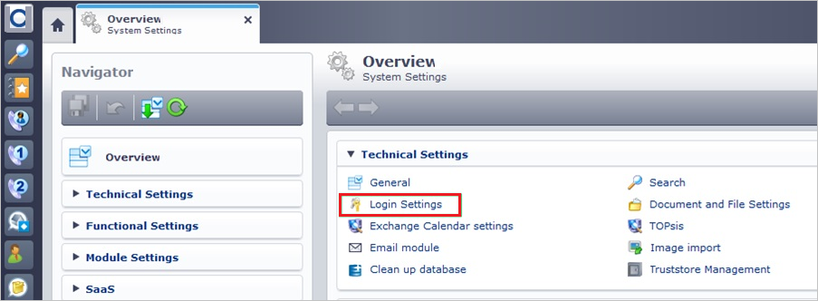
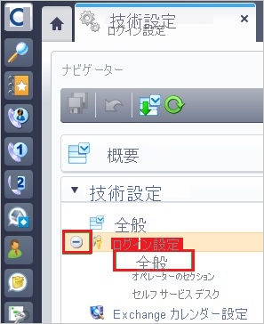
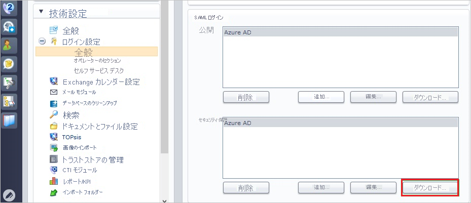
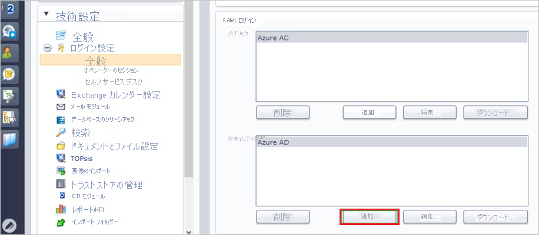
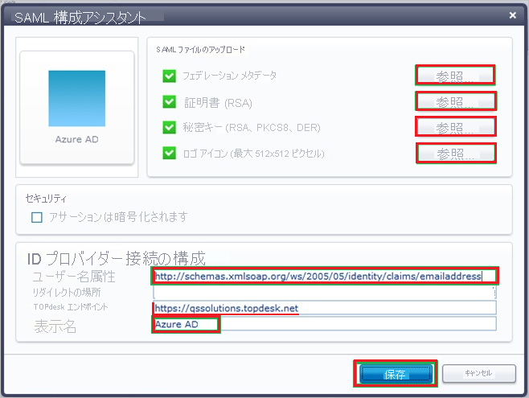

# チュートリアル: Azure AD SSO と TOPdesk - Secure の統合

このチュートリアルでは、TOPdesk - Secure と Azure Active Directory (Azure AD) を統合する方法について説明します。 TOPdesk - Secure と Azure AD を統合すると、次のことができます。

* TOPdesk - Secure にアクセスする Azure AD ユーザーを制御する。
* ユーザーが自分の Azure AD アカウントで TOPdesk - Secure に自動的にサインイン (シングル サインオン) するように設定する。
* 1 つの中央サイト (Azure Portal) で自分のアカウントを管理します。

## 前提条件

開始するには、次が必要です。
 
 * Azure AD サブスクリプション。 サブスクリプションがない場合は、[無料アカウント](https://azure.microsoft.com/free/)を取得できます。
* TOPdesk - Secure でのシングル サインオン (SSO) が有効なサブスクリプション。

## シナリオの説明

このチュートリアルでは、テスト環境で Azure AD のシングル サインオンを構成してテストします。

* TOPdesk - Secure では、**SP** によって開始される SSO がサポートされます。

## ギャラリーからの TOPdesk - Secure の追加

Azure AD への TOPdesk - Secure の統合を構成するには、管理対象の SaaS アプリの一覧にギャラリーから TOPdesk - Secure を追加する必要があります。

1. 職場または学校アカウントか、個人の Microsoft アカウントを使用して、Azure portal にサインインします。
1. 左のナビゲーション ウィンドウで **[Azure Active Directory]** サービスを選択します。
1. **[エンタープライズ アプリケーション]** に移動し、 **[すべてのアプリケーション]** を選択します。
1. 新しいアプリケーションを追加するには、 **[新しいアプリケーション]** を選択します。
1. **[ギャラリーから追加する]** セクションで、検索ボックスに「**TOPdesk - Secure**」と入力します。
1. 結果のパネルから **TOPdesk - Secure** を選択し、アプリを追加します。 お使いのテナントにアプリが追加されるのを数秒待機します。

## TOPdesk - Secure の Azure AD SSO の構成とテスト

このセクションでは、**Britta Simon** というテスト ユーザーに基づいて、TOPdesk - Secure で Azure AD のシングル サインオンを構成し、テストします。
シングル サインオンを機能させるには、Azure AD ユーザーと TOPdesk - Secure 内の関連ユーザーとの間にリンク関係が確立されている必要があります。

TOPdesk - Secure で Azure AD のシングル サインオンを構成してテストするには、次の手順を実行する必要があります。

1. **[Azure AD SSO の構成](#configure-azure-ad-sso)** - ユーザーがこの機能を使用できるようにします。
    1. **[Azure AD のテスト ユーザーの作成](#create-an-azure-ad-test-user)** - Britta Simon で Azure AD のシングル サインオンをテストします。
    2. **[Azure AD テスト ユーザーの割り当て](#assign-the-azure-ad-test-user)** - Britta Simon が Azure AD シングル サインオンを使用できるようにします。
2. **[TOPdesk - Secure の SSO の構成](#configure-topdesk---secure-sso)** - アプリケーション側でシングル サインオン設定を構成します。
    1. **[TOPdesk - Secure のテスト ユーザーの作成](#create-topdesk---secure-test-user)** - TOPdesk - Secure で Britta Simon に対応するユーザーを作成し、Azure AD の Britta Simon にリンクします。
1. **[SSO のテスト](#test-sso)** - 構成が機能するかどうかを確認します。

## Azure AD SSO の構成

このセクションでは、Azure portal 上で Azure AD のシングル サインオンを有効にします。

TOPdesk - Secure で Azure AD シングル サインオンを構成するには、次の手順に従います。

1. Azure portal の **TOPdesk - Secure** アプリケーション統合ページで、 **[シングル サインオン]** を選択します。

2. **[シングル サインオン方式の選択]** ダイアログで、 **[SAML/WS-Fed]** モードを選択して、シングル サインオンを有効にします。

3. **[SAML でシングル サインオンをセットアップします]** ページで、鉛筆アイコンをクリックして **[基本的な SAML 構成]** ダイアログを開きます。

    

4. **[基本的な SAML 構成]** セクションで、次の手順を実行します。

    a. **[Identifier URL]\(識別子 URL\)** ボックスに、TOPdesk 構成から取得できる TOPdesk メタデータ URL を入力します。 これには次のパターンを使用する必要があります: `https://<companyname>.topdesk.net/saml-metadata/<identifier>`

    b. **[応答 URL]** ボックスに、`https://<companyname>.topdesk.net/tas/secure/login/verify` のパターンを使用して URL を入力します

    c. **[サインオン URL]** ボックスに、`https://<companyname>.topdesk.net` という形式で URL を入力します。

    > [!NOTE]
    > これらは実際の値ではありません。 実際の識別子、応答 URL、サインオン URL でこれらの値を更新します。 これらの値を取得するには、[TOPdesk - Secure クライアント サポート チーム](https://www.topdesk.com/en/services/support/)に問い合わせてください。 Azure portal の **[基本的な SAML 構成]** セクションに示されているパターンを参照することもできます。

5. **[SAML でシングル サインオンをセットアップします]** ページの **[SAML 署名証明書]** セクションで、 **[ダウンロード]** をクリックして、要件のとおりに指定したオプションから **フェデレーション メタデータ XML** をダウンロードして、お使いのコンピューターに保存します。

    

6. **[TOPdesk - Secure のセットアップ]** セクションで、要件に従って適切な URL をコピーします。

    

### Azure AD のテスト ユーザーの作成 

このセクションでは、Azure portal 内で B.Simon というテスト ユーザーを作成します。

1. Azure portal の左側のウィンドウから、 **[Azure Active Directory]** 、 **[ユーザー]** 、 **[すべてのユーザー]** の順に選択します。
1. 画面の上部にある **[新しいユーザー]** を選択します。
1. **[ユーザー]** プロパティで、以下の手順を実行します。
   1. **[名前]** フィールドに「`B.Simon`」と入力します。  
   1. **[ユーザー名]** フィールドに「username@companydomain.extension」と入力します。 たとえば、「 `B.Simon@contoso.com` 」のように入力します。
   1. **[パスワードを表示]** チェック ボックスをオンにし、 **[パスワード]** ボックスに表示された値を書き留めます。
   1. **Create** をクリックしてください。

### Azure AD テスト ユーザーの割り当て

このセクションでは、B.Simon に TOPdesk - Secure へのアクセスを許可することで、このユーザーが Azure シングル サインオンを使用できるようにします。

1. Azure portal で **[エンタープライズ アプリケーション]** を選択し、 **[すべてのアプリケーション]** を選択します。
1. アプリケーションの一覧で **[TOPdesk - Public]** を選択します。
1. アプリの概要ページで、 **[管理]** セクションを見つけて、 **[ユーザーとグループ]** を選択します。
1. **[ユーザーの追加]** を選択し、 **[割り当ての追加]** ダイアログで **[ユーザーとグループ]** を選択します。
1. **[ユーザーとグループ]** ダイアログの [ユーザー] の一覧から **[B.Simon]** を選択し、画面の下部にある **[選択]** ボタンをクリックします。
1. ユーザーにロールが割り当てられることが想定される場合は、 **[ロールの選択]** ドロップダウンからそれを選択できます。 このアプリに対してロールが設定されていない場合は、[既定のアクセス] ロールが選択されていることを確認します。
1. **[割り当ての追加]** ダイアログで、 **[割り当て]** をクリックします。

## TOPdesk - Secure の SSO の構成

1. **TOPdesk - Secure** 会社サイトに管理者としてサインインします。

2. [**TOPdesk**] メニューで、[**設定**] をクリックします。

    ![[設定]](./media/topdesk-secure-tutorial/menu.png "設定")

3. [**ログイン設定**] をクリックします。

    

4. [**ログイン設定**] メニューを展開し、[**全般**] をクリックします。

    

5. [**SAML ログイン**] 構成セクションの [**セキュリティ保護**] セクションで、次の手順を実行します。

    

    a. [**ダウンロード**] をクリックして公開メタデータ ファイルをダウンロードし、コンピューターのローカルに保存します。

    b. メタデータ ファイルを開き、**AssertionConsumerService** ノードを探します。

    

    c. **[AssertionConsumerService]** の値をコピーし、**[TOPdesk - Secure のドメインと URL]** セクションの [応答 URL] ボックスにこの値を貼り付けます。

6. 証明書ファイルを作成するには、次の手順を実行します。

    ![[MSSQLSERVER のプロトコルのプロパティ]](./media/topdesk-secure-tutorial/file.png "Certificate")

    a. Azure Portal からダウンロードしたメタデータ ファイルを開きます。

    b. **RoleDescriptor** ノードを展開します。ここには **fed:ApplicationServiceType** の **xsi:type** があります。

    c. **X509Certificate** ノードの値をコピーします。

    d. コピーした **X509Certificate** の値をコンピューターのローカルのファイルに保存します。

7. [**公開**] セクションで、[**追加**] をクリックします。

    

8. [**SAML 構成アシスタント**] ダイアログ ページで、次の手順を実行します。

    

    a. Azure Portal からダウンロードしたメタデータ ファイルをアップロードするには、**[Federation Metadata]** で **[Browse]** をクリックします。

    b. 証明書ファイルをアップロードするには、[**証明書 (RSA)**] の下の [**参照**] をクリックします。

    c. **[Private key(RSA, PKCS8, DER)]** では、独自の秘密キーをアップロードするか、[TOPdesk - Secure Client サポート チーム](https://www.topdesk.com/en/services/support/)に問い合わせて秘密キーを取得できます。

    d. TOPdesk サポート チームから取得したロゴ ファイルをアップロードするには、[**ロゴ アイコン**] の下の [**参照**] をクリックします。

    e. **[User name attribute]** ボックスに、「`http://schemas.xmlsoap.org/ws/2005/05/identity/claims/emailaddress`」と入力します。

    f. [**表示名**] テキストボックスに、構成の名前を入力します。

    g. **[保存]** をクリックします。

### TOPdesk - Secure のテスト ユーザーの作成

Azure AD ユーザーが TOPdesk - Secure にログインできるようにするには、そのユーザーを TOPdesk - Secure にプロビジョニングする必要があります。  
TOPdesk - Secure の場合、プロビジョニングは手動で行います。

### ユーザー プロビジョニングを構成するには、次の手順に従います。

1. **TOPdesk - Secure** 企業サイトに管理者としてサインオンします。

2. 上部のメニューで、**[TOPdesk]\>[New]\>[Support Files]\>[Operator]** の順にクリックします。

    ![[オペレーター]](./media/topdesk-secure-tutorial/support-files.png "オペレーター")

3. [**新しいオペレーター**] ダイアログ ボックスで、次の手順を実行します。

    

    a. **[General]** タブをクリックします。

    b. **[Surname]** ボックスに、ユーザーの姓を入力します (この例では **Simon**)。

    c. [**場所**] セクションでアカウントの **サイト** を選択します。

    d. [**TOPdesk ログイン**] セクションの [**ログイン名**] テキストボックスにユーザーのログイン名を入力します。

    e. **[保存]** をクリックします。

> [!NOTE]
> 他の TOPdesk - Secure ユーザー アカウント作成ツールや、TOPdesk - Secure から提供されている API を使用して、Azure AD ユーザー アカウントをプロビジョニングできます。

## SSO のテスト

このセクションでは、次のオプションを使用して Azure AD のシングル サインオン構成をテストします。 

* Azure portal で **[このアプリケーションをテストします]** をクリックします。 これにより、ログイン フローを開始できる TOPdesk - Secure のサインオン URL にリダイレクトされます。 

* TOPdesk - Secure のサインオン URL に直接移動し、そこからログイン フローを開始します。

* Microsoft マイ アプリを使用することができます。 マイ アプリで [TOPdesk - Secure] タイルをクリックすると、SSO を設定した TOPdesk - Secure に自動的にサインインします。 マイ アプリの詳細については、[マイ アプリの概要](https://support.microsoft.com/account-billing/sign-in-and-start-apps-from-the-my-apps-portal-2f3b1bae-0e5a-4a86-a33e-876fbd2a4510)に関するページを参照してください。

## 次のステップ

TOPdesk - Secure を構成したら、組織の機密データを流出と侵入からリアルタイムで保護するセッション制御を適用できます。 セッション制御は、条件付きアクセスを拡張したものです。 [Microsoft Defender for Cloud Apps でセッション制御を強制する方法](/cloud-app-security/proxy-deployment-any-app)をご覧ください。
