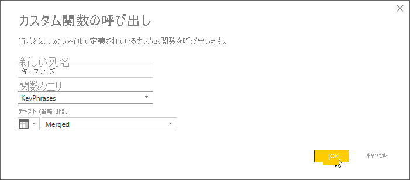
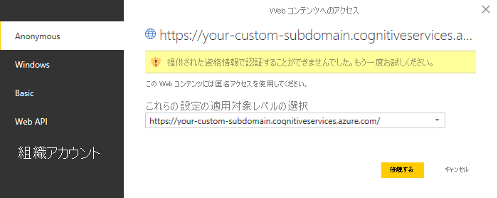
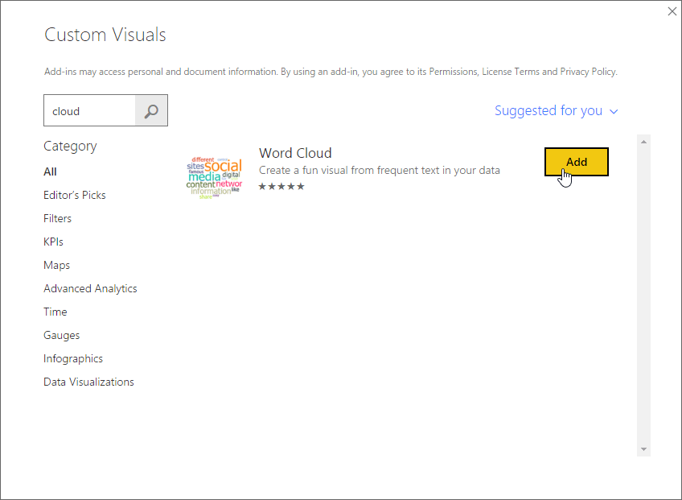

# <a name="tutorial-extract-key-phrases-from-text-stored-in-power-bi"></a>チュートリアル: Power BI に保存されているテキストからキー フレーズを抽出する

Microsoft Power BI Desktop は、データへの接続、データの変換、およびデータの視覚化を実行できる無料のアプリケーションです。 Azure Cognitive Service for Language の機能の 1 つであるキー フレーズ抽出では、自然言語処理が提供されます。 それは、与えられた未加工の構造化されていないテキストから、最も重要なフレーズの抽出、感情の分析、およびブランドなどのよく知られているエンティティの識別を行うことができます。 これらのツールを組み合わせることで、ユーザーが話している内容とそれに対する感情をすばやく確認できます。

このチュートリアルで学習する内容は次のとおりです。

> [!div class="checklist"]
> * Power BI Desktop を使用してデータをインポートして変換する
> * Power BI Desktop でカスタム関数を作成する
> * Power BI Desktop を Azure Cognitive Service for Language のキー フレーズ抽出機能と統合する
> * キー フレーズ抽出を使用して、顧客のフィードバックから最も重要なフレーズを取得する
> * ユーザーのフィードバックからワード クラウドを作成する

## <a name="prerequisites"></a>前提条件

- Microsoft Power BI Desktop。 [無料でダウンロードできます](https://powerbi.microsoft.com/get-started/)。
- Microsoft Azure アカウント。 [無料アカウントを作成](https://azure.microsoft.com/free/cognitive-services/)するか、[サインイン](https://portal.azure.com/)してください。
- 言語リソース。 持っていない場合は、[作成](https://ms.portal.azure.com/#create/Microsoft.CognitiveServicesTextAnalytics)できます。
- サインアップ時に生成された[言語リソース キー](../../../cognitive-services-apis-create-account.md#get-the-keys-for-your-resource)。
- ユーザーのコメント。 [用意されているサンプル データ](https://aka.ms/cogsvc/ta)または自身のデータを使用できます。 このチュートリアルでは、サンプル データを使用することを前提としています。

## <a name="load-customer-data"></a>ユーザーのデータを読み込む

開始するには、Power BI Desktop を開き、[前提条件](#prerequisites)でダウンロードしたコンマ区切り (CSV) ファイルの `FabrikamComments.csv` を読み込みます。 このファイルは、架空の小規模な会社のサポート フォーラムの 1 日分の仮想的なアクティビティを表しています。

> [!NOTE]
> Power BI では、SQL Database など、さまざまな Web ベース ソースのデータを使用できます。 詳細については [Power Query ドキュメント](/power-query/connectors/)を参照してください。

Power BI Desktop のメイン ウィンドウで、 **[ホーム]** リボンを選択します。 リボンの **[外部データ]** グループで、 **[データの取得]** ドロップダウン メニューを開き、 **[テキスト/CSV]** を選択します。

![[データの取得] ボタン](../media/tutorials/power-bi/get-data-button.png)

[開く] ダイアログが表示されます。 [ダウンロード] フォルダーまたは `FabrikamComments.csv` ファイルをダウンロードしたフォルダーに移動します。 `FabrikamComments.csv` をクリックし、 **[開く]** ボタンをクリックします。 CSV のインポート ダイアログが表示されます。

![[CSV インポート] ダイアログ](../media/tutorials/power-bi/csv-import.png)

[CSV インポート] ダイアログでは、Power BI Desktop で文字セット、区切り文字、ヘッダー行、および列の種類が正しく検出されたことを確認できます。 この情報はすべて正しいので、 **[読み込み]** をクリックします。

読み込まれたデータを表示するには、Power BI ワークスペースの左端にある **[データ ビュー]** ボタンをクリックします。 データを含むテーブル (Microsoft Excel に似ています) が開きます。


## <a name="prepare-the-data"></a>データを準備する

キー フレーズ抽出によって処理できるように、Power BI Desktop のデータを変換する必要がある場合があります。

サンプル データには、`subject` 列と `comment` 列が含まれています。 Power BI Desktop で列のマージ関数を使用して、`comment` 列だけではなく、両方の列のデータからキー フレーズを抽出できます。

Power BI Desktop で、 **[ホーム]** リボンを選択します。 **[外部データ]** グループで、 **[クエリの編集]** をクリックします。

![[ホーム] リボンの [外部データ] グループ](../media/tutorials/power-bi/edit-queries.png)

ウィンドウの左側にある **[クエリ]** の一覧で `FabrikamComments` がまだ選択されていない場合は選択します。

次に、テーブル内の `subject` 列と `comment` 列の両方を選択します。 これらの列を表示するには、必要に応じて横にスクロールします。 まず `subject` 列ヘッダーをクリックし、Ctrl キーを押しながら `comment` 列ヘッダーをクリックします。


**[変換]** リボンを選択します。 リボンの **[テキスト列]** グループで、 **[列のマージ]** をクリックします。 [列のマージ] ダイアログが表示されます。

![[列のマージ] ダイアログを使用したフィールドのマージ](../media/tutorials/power-bi/merge-columns.png)

[列のマージ] ダイアログで区切りとして `Tab` を選択してから **[OK]** をクリックします。

[空の削除] フィルターを使用して空白のメッセージを除外したり、[Clean transformation]\(変換のクリア\) を使用して印刷できない文字を削除したりすることもできます。 サンプル ファイルの `spamscore` 列のような列がデータに含まれている場合は、[数値フィルター] を使用して "スパム" コメントをスキップできます。

## <a name="understand-the-api"></a>API を理解する

[キー フレーズ抽出](https://westus.dev.cognitive.microsoft.com/docs/services/TextAnalytics-V3-1/operations/KeyPhrases)では、HTTP 要求ごとに最大 1,000 個のテキスト ドキュメントを処理できます。 Power BI では一度に 1 レコードずつ処理する方が好まれるため、このチュートリアルでは、API の各呼び出しには 1 つのドキュメントのみが含まれます。 Key Phrases API では、処理されるドキュメントごとに次のフィールドが必要です。

| フィールド | 説明 |
| - | - |
| `id`  | 要求内のこのドキュメントの一意の識別子。 応答にもこのフィールドが含まれます。 そのため、複数のドキュメントを処理する場合、抽出されたキー フレーズを元のドキュメントと簡単に関連付けることができます。 このチュートリアルでは、要求ごとに 1 つのドキュメントのみを処理するため、各要求の `id` 値が同じになるようにハード コーディングできます。|
| `text`  | 処理されるテキスト。 このフィールドの値は、[前のセクション](#prepare-the-data)で作成した `Merged` 列に基づきます。それには、結合された subject の行と comment のテキストが含まれています。 Key Phrases API では、このデータの文字数の上限は約 5,120 文字です。|
| `language` | ドキュメントの記述に使用されている自然言語を表すコード。 サンプル データのすべてのメッセージは英語で記述されているため、このフィールドの値である `en` はハード コーディングできます。|

## <a name="create-a-custom-function"></a>カスタム関数を作成する

これで、Power BI とキー フレーズ抽出を統合するカスタム関数を作成する準備ができました。 この関数は、処理されるテキストをパラメーターとして受け取ります。 必要な JSON 形式との間でデータを変換し、Key Phrases API エンドポイントへの HTTP 要求を行います。 その後、関数は、API からの応答を解析し、抽出されたキー フレーズのコンマ区切りの一覧を含む文字列を返します。

> [!NOTE]
> Power BI Desktop のカスタム関数は、[Power Query M 式言語](/powerquery-m/power-query-m-reference)、または省略形の "M" と書かれます。 M は、[F#](/dotnet/fsharp/) に基づく関数型プログラミング言語です。 ただし、このチュートリアルを完了するためにプログラマーである必要はありません。必要なコードは以下に含まれています。

Power BI Desktop で、クエリ エディター ウィンドウにいることを確認します。 そうでない場合は、 **[ホーム]** リボンを選択し、 **[外部データ]** グループの **[クエリの編集]** をクリックします。

次に、 **[ホーム]** リボンの **[新しいクエリ]** グループで、 **[新しいソース]** ドロップダウン メニューを開き、 **[空のクエリ]** を選択します。 

[クエリ] リストに新しいクエリが表示されます。最初は `Query1` という名前が付けられます。 このエントリをダブルクリックし、`KeyPhrases` と名前を付けます。

**[ホーム]** リボンの **[クエリ]** グループで **[詳細エディター]** をクリックして、[詳細エディター] ウィンドウを開きます。 そのウィンドウに既にあるコードを削除し、次のコードに貼り付けます。 

> [!NOTE]
> 下のサンプル エンドポイント (`<your-custom-subdomain>` を含む) を、言語リソース用に生成されたエンドポイントに置き換えます。 このエンドポイントを見つけるには、[Azure portal](https://azure.microsoft.com/features/azure-portal/) にサインインし、リソースに移動して、 **[Key and endpoint]\(キーとエンドポイント\)** を選択します。


```fsharp
// Returns key phrases from the text in a comma-separated list
(text) => let
    apikey      = "YOUR_API_KEY_HERE",
    endpoint    = "https://<your-custom-subdomain>.cognitiveservices.azure.com/text/analytics" & "/v3.0/keyPhrases",
    jsontext    = Text.FromBinary(Json.FromValue(Text.Start(Text.Trim(text), 5000))),
    jsonbody    = "{ documents: [ { language: ""en"", id: ""0"", text: " & jsontext & " } ] }",
    bytesbody   = Text.ToBinary(jsonbody),
    headers     = [#"Ocp-Apim-Subscription-Key" = apikey],
    bytesresp   = Web.Contents(endpoint, [Headers=headers, Content=bytesbody]),
    jsonresp    = Json.Document(bytesresp),
    keyphrases  = Text.Lower(Text.Combine(jsonresp[documents]{0}[keyPhrases], ", "))
in  keyphrases
```

`YOUR_API_KEY_HERE` を言語リソース キーに置き換えます。 このキーを見つけるもう 1 つの方法は、[Azure portal](https://azure.microsoft.com/features/azure-portal/) にサインインして、言語リソースに移動し、 **[Key and endpoint]\(キーとエンドポイント\)** ページを選択することです。 キーの前後には必ず引用符を入れてください。 次に、 **[完了]** をクリックします。

## <a name="use-the-custom-function"></a>カスタム関数を使用する

これで、カスタム関数を使用して、ユーザーの各コメントに含まれるキー フレーズを抽出し、それらをテーブルの新しい列に格納できるようになりました。 

Power BI Desktop のクエリ エディター ウィンドウで、`FabrikamComments` クエリに切り替えて戻ります。 **[列の追加]** リボンを選択します。 **[全般]** グループで、 **[カスタム関数の呼び出し]** をクリックします。

![[カスタム関数の呼び出し] ボタン](../media/tutorials/power-bi/invoke-custom-function-button.png)<br><br>

[カスタム関数の呼び出し] ダイアログが表示されます。 **[新しい列名]** に、「`keyphrases`」と入力します。 **[関数クエリ]** で、作成したカスタム関数 `KeyPhrases` を選択します。

新しいフィールドの **[テキスト (省略可)]** がダイアログに表示されます。 このフィールドには、Key Phrases API の `text` パラメーターの値を指定するために使用する列を指定します (`language` パラメーターと `id` パラメーターの値は既にハードコーディングしていることを思い出してください)。ドロップダウン メニューから `Merged` ([先ほど](#prepare-the-data) subject フィールドと message フィールドをマージして作成した列) を選択します。



最後に **[OK]** をクリックします。

すべての準備が整っていれば、Power BI は、テーブルの行ごとにカスタム関数を 1 回呼び出します。 それは、Key Phrases API にクエリを送信し、結果を格納するための新しい列をテーブルに追加します。 ただし、その処理が実行される前に、必要に応じて認証とプライバシーの設定を指定します。

## <a name="authentication-and-privacy"></a>認証とプライバシー

[カスタム関数の呼び出し] ダイアログを閉じると、Key Phrases API に接続する方法を指定するように求めるバナーが表示されることがあります。


**[資格情報の編集]** ダイアログで `Anonymous` が選択されていることを確認し、 **[接続]** をクリックします。 

> [!NOTE]
> キー フレーズ抽出ではユーザーのアクセス キーを使用して要求が認証されるため、Power BI は HTTP 要求自体の資格情報を提供する必要がないので、`Anonymous` を選択します。

> [!div class="mx-imgBorder"]
> 

匿名アクセスを選択した後も [資格情報の編集] バナーが表示される場合は、`KeyPhrases` [カスタム関数](#create-a-custom-function)内のコードに言語リソース キーを貼り付け忘れた可能性があります。

次に、データ ソースのプライバシーに関する情報の入力を求めるバナーが表示されることがあります。 


**[続行]** をクリックし、ダイアログ内の各データ ソースに対して `Public` を選択します。 **[保存]** をクリックします。


## <a name="create-the-word-cloud"></a>ワード クラウドを作成する

表示されるバナーを処理したら、[ホーム] リボンの **[Close & Apply]\(閉じて適用\)** をクリックしてクエリ エディターを閉じます。

Power BI Desktop で必要な HTTP 要求の実行が完了するまで少し待ちます。 テーブルの各行の新しい `keyphrases` 列には、Key Phrases API によって検出されたテキストのキー フレーズが含まれています。 

次に、この列を使用してワード クラウドを生成します。 まず、ワークスペースの左側にある Power BI Desktop のメイン ウィンドウの **[レポート]** ボタンをクリックします。

> [!NOTE]
> すべてのコメントの全文ではなく、抽出されたキー フレーズを使用してワード クラウドを生成する理由は、 キー フレーズで、ユーザーのコメントから *最も一般的な* 単語だけでなく *重要な* 単語が提供されるためです。 また、比較的少数のコメントで 1 つの単語が頻繁に使用されることで、結果として得られるクラウドの単語のサイズ指定が偏ることはありません。

Word Cloud カスタム ビジュアルをまだインストールしていない場合は、インストールします。 ワークスペースの右側にある [視覚化] パネルで、3 つのドット ( **[...]** ) をクリックし、 **[Import From Market]\(マーケットからインポート\)** を選択します。 一覧に表示されている視覚化ツールの中に "cloud" という単語が存在しない場合は、"cloud" を検索して、Word Cloud のビジュアルの横にある **[追加]** ボタンをクリックします。 Power BI に Word Cloud ビジュアルがインストールされると、正常にインストールされたことが通知されます。

<br><br>

まず [視覚化] パネルの Word Cloud アイコンをクリックします。

![視覚化パネルの [Word Cloud] アイコン](../media/tutorials/power-bi/visualizations-panel.png)

ワークスペースに新しいレポートが表示されます。 [フィールド] パネルの [`keyphrases`] フィールドを [視覚化] パネルの [カテゴリ] フィールドにドラッグします。 レポート内にワード クラウドが表示されます。

次に [視覚化] パネルの [書式設定] ページに切り替えます。 クラウドから短い一般的な単語 ("of" など) を除外するには、[ストップ ワード] カテゴリで **[既定のストップ ワード]** を有効にします。 ただし、視覚化しているのはキー フレーズであるため、ストップ ワードが含まれていない可能性があります。


このパネルをもう少し下にスクロールし、 **[テキストの回転]** と **[タイトル]** をオフにします。


レポートのフォーカス モード ツールをクリックすると、ワード クラウドの詳細が表示されます。 ツールでワード クラウドが展開され、図のようにワークスペース全体に表示されます。


## <a name="using-other-features"></a>その他の機能の使用

Azure Cognitive Service for Language では、感情分析と言語検出も提供されます。 言語検出機能は、ユーザーのフィードバックがすべて英語ではない場合に特に役立ちます。

これらの API は、両方とも Key Phrases API に似ています。 つまり、このチュートリアルで作成したものとほぼ同じカスタム関数を使用して、それらを Power BI Desktop に統合できます。 空のクエリを作成して、先ほどと同じように以下の適切なコードを詳細エディターに貼り付けます (アクセス キーを忘れないでください)。前回と同様に、関数を使用してテーブルに新しい列を追加します。

以下の感情分析機能では、テキストに示されている感情がどの程度肯定的かを示すラベルが返されます。

```fsharp
// Returns the sentiment label of the text, for example, positive, negative or mixed.
(text) => let
    apikey = "YOUR_API_KEY_HERE",
    endpoint = "<your-custom-subdomain>.cognitiveservices.azure.com" & "/text/analytics/v3.1/sentiment",
    jsontext = Text.FromBinary(Json.FromValue(Text.Start(Text.Trim(text), 5000))),
    jsonbody = "{ documents: [ { language: ""en"", id: ""0"", text: " & jsontext & " } ] }",
    bytesbody = Text.ToBinary(jsonbody),
    headers = [#"Ocp-Apim-Subscription-Key" = apikey],
    bytesresp = Web.Contents(endpoint, [Headers=headers, Content=bytesbody]),
    jsonresp = Json.Document(bytesresp),
    sentiment   = jsonresp[documents]{0}[sentiment] 
    in sentiment
```

言語検出機能には 2 つのバージョンがあります。 1 つ目では ISO 言語コードが返されます (例: 英語の場合は `en`)。一方、2 つ目では "わかりやすい" 名前 (たとえば `English`) が返されます。 ご覧のように、2 つのバージョンは本文の最後の行のみが異なります。

```fsharp
// Returns the two-letter language code (for example, 'en' for English) of the text
(text) => let
    apikey      = "YOUR_API_KEY_HERE",
    endpoint    = "https://<your-custom-subdomain>.cognitiveservices.azure.com" & "/text/analytics/v3.1/languages",
    jsontext    = Text.FromBinary(Json.FromValue(Text.Start(Text.Trim(text), 5000))),
    jsonbody    = "{ documents: [ { id: ""0"", text: " & jsontext & " } ] }",
    bytesbody   = Text.ToBinary(jsonbody),
    headers     = [#"Ocp-Apim-Subscription-Key" = apikey],
    bytesresp   = Web.Contents(endpoint, [Headers=headers, Content=bytesbody]),
    jsonresp    = Json.Document(bytesresp),
    language    = jsonresp [documents]{0}[detectedLanguage] [iso6391Name] in language 
```
```fsharp
// Returns the name (for example, 'English') of the language in which the text is written
(text) => let
    apikey      = "YOUR_API_KEY_HERE",
    endpoint    = "https://<your-custom-subdomain>.cognitiveservices.azure.com" & "/text/analytics/v3.1/languages",
    jsontext    = Text.FromBinary(Json.FromValue(Text.Start(Text.Trim(text), 5000))),
    jsonbody    = "{ documents: [ { id: ""0"", text: " & jsontext & " } ] }",
    bytesbody   = Text.ToBinary(jsonbody),
    headers     = [#"Ocp-Apim-Subscription-Key" = apikey],
    bytesresp   = Web.Contents(endpoint, [Headers=headers, Content=bytesbody]),
    jsonresp    = Json.Document(bytesresp),
    language    jsonresp [documents]{0}[detectedLanguage] [iso6391Name] in language 
```

最後に、前述の Key Phrases 関数を、コンマで区切られたフレーズの単一の文字列ではなく、フレーズをリスト オブジェクトとして返すように変更した関数を次に示します。 

> [!NOTE]
> 単一の文字列を返すことで、ワード クラウドの例が簡単になりました。 一方、リストは、Power BI で返されたフレーズを処理する場合により柔軟な形式です。 クエリ エディターの [変換] リボンの [構造化列] グループを使用して、Power BI Desktop のリスト オブジェクトを操作できます。

```fsharp
// Returns key phrases from the text as a list object
(text) => let
    apikey      = "YOUR_API_KEY_HERE",
    endpoint    = "https://<your-custom-subdomain>.cognitiveservices.azure.com" & "/text/analytics/v3.1/keyPhrases",
    jsontext    = Text.FromBinary(Json.FromValue(Text.Start(Text.Trim(text), 5000))),
    jsonbody    = "{ documents: [ { language: ""en"", id: ""0"", text: " & jsontext & " } ] }",
    bytesbody   = Text.ToBinary(jsonbody),
    headers     = [#"Ocp-Apim-Subscription-Key" = apikey],
    bytesresp   = Web.Contents(endpoint, [Headers=headers, Content=bytesbody]),
    jsonresp    = Json.Document(bytesresp),
    keyphrases  = jsonresp[documents]{0}[keyPhrases]
in  keyphrases
```

## <a name="next-steps"></a>次のステップ

Azure Cognitive Service for Language、Power Query M 式言語、または Power BI の詳細を学習してください。

* [Azure Cognitive Service for Language の概要](../../overview.md)
* [Power Query M リファレンス](/powerquery-m/power-query-m-reference)
* [Power BI のドキュメント](https://powerbi.microsoft.com/documentation/powerbi-landing-page/)
