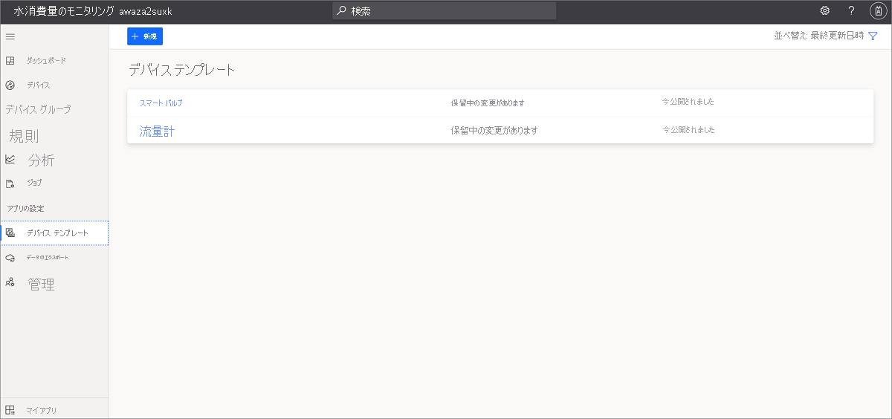
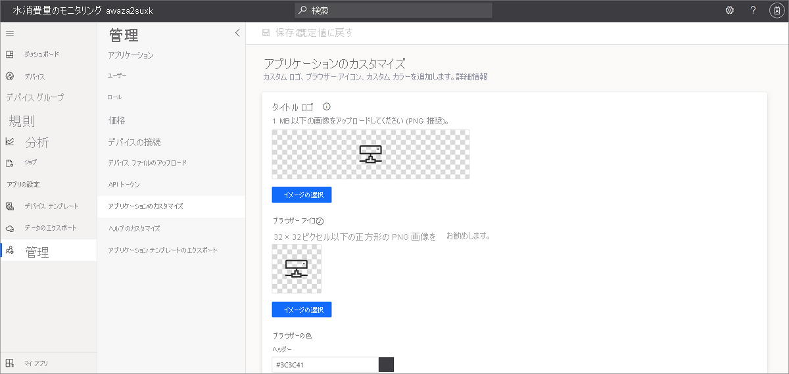

# チュートリアル: 水消費量のモニタリング アプリケーションをデプロイして調べる

IoT Central の "*水消費量のモニタリング*" アプリケーション テンプレートとこの記事のガイダンスを使用して、エンドツーエンドの水消費量のモニタリング ソリューションを開発します。

### デバイスと接続

水管理ソリューションでは、流量計、水質モニター、スマート バルブ、漏れ検知器などのスマート ウォーター デバイスを使用します。

スマート ウォーター ソリューションのデバイスは、省電力広域ネットワーク (LPWAN) またはサードパーティのネットワーク オペレーターを介して接続できます。 これらの種類のデバイスでは、[Azure IoT Central デバイス ブリッジ](../core/howto-build-iotc-device-bridge.md)を使用して、Azure IoT Central の IoT アプリケーションに自分のデバイス データを送信します。 または、IP 対応で IoT Central に直接接続可能なデバイス ゲートウェイを使用することもできます。

### IoT Central

Azure IoT Central は、IoT ソリューションを迅速に構築してデプロイするのに役立つ IoT アプリケーション プラットフォームです。 サードパーティのサービスを使用して、ソリューションをブランド化、カスタマイズ、統合することができます。

スマート ウォーター デバイスを IoT Central に接続すると、アプリケーションによって、デバイス コマンドと制御、監視とアラート、RBAC が組み込まれたユーザー インターフェイス、構成可能なダッシュボード、拡張オプションが提供されます。

### 拡張性と統合

IoT Central で IoT アプリケーションを拡張し、必要に応じて次のことを行うことができます。

* IoT Central アプリケーションからの継続的なデータ エクスポートを使用して、機械学習モデルのトレーニングなどの高度な分析のために IoT データを変換して統合します。
* Power Automate または IoT Central アプリケーションの Webhook を使用してアクションをトリガーし、他のシステムのワークフローを自動化します。
* IoT Central API を使用して IoT Central で IoT アプリケーションにプログラムでアクセスします。

### ビジネス アプリケーション

IoT データを使用して、水道施設内でさまざまなビジネス アプリケーションを強化することができます。 [IoT Central 水消費量のモニタリング アプリケーション](tutorial-water-consumption-monitoring.md)では、ルールやアクションを構成し、[Connected Field Service](/dynamics365/field-service/connected-field-service) でアラートを作成するように設定できます。 IoT Central のルールで Power Automate を構成し、アプリケーションやサービス間のワークフローを自動化します。 また、Connected Field Service のサービス アクティビティに基づいて、情報を Azure IoT Central に送り返すことができます。

このチュートリアルでは、次の作業を行う方法について説明します。

> [!div class="checklist"]

> * Azure IoT Central の水消費量のモニタリング テンプレートを使用して、水消費量のモニタリング アプリケーションを作成する。
> * ダッシュボードをいろいろ試してみてからカスタマイズします。
> * デバイス テンプレートを探索します。
> * シミュレートされたデバイスを探索します。
> * ルールを探索して構成します。
> * ジョブを構成します。
> * ホワイト ラベルを使用してアプリケーション ブランドをカスタマイズします。

## 前提条件

* このアプリをデプロイするために必要な前提条件は特にありません。
* 無料価格プランを使用するか、Azure サブスクリプションを使用することができます。

## 水消費量のモニタリング アプリケーションを作成する

次の手順に従ってアプリケーションを作成します。

1. [Azure IoT Central ビルド](https://aka.ms/iotcentral) Web サイトに移動します。 次に、Microsoft 個人アカウントか、職場または学校アカウントを使用してサインインします。 左側のナビゲーションバーから **[ビルド]** を選択し、 **[政府機関]** タブを選択します。:::image type="content" source="media/tutorial-waterconsumptionmonitoring/iot-central-government-tab-overview1.png" alt-text="アプリケーション テンプレート":::

1. **[水消費量のモニタリング]** で **[アプリの作成]** を選択します。

詳細については、「[IoT Central アプリケーションを作成する](../core/howto-create-iot-central-application.md)」を参照してください。

## アプリケーションを調べる

以降のセクションでは、アプリケーションの主な機能について見ていきます。

### ダッシュボード

アプリケーションを作成した後、サンプルの **[Wide World water consumption dashboard]\(Wide World の水消費量ダッシュボード\)** が開きます。
  
:::image type="content" source="media/tutorial-waterconsumptionmonitoring/water-consumption-monitoring-dashboard-full.png" alt-text="水消費量のモニタリング ダッシュボード。":::

オペレーター用のダッシュボードのビューを作成したりカスタマイズしたりすることができます。

> [!NOTE]
> ダッシュボードに表示されるすべてのデータは、シミュレートされたデバイス データに基づいています。これについては、次のセクションで詳しく説明します。
  
ダッシュボードは、さまざまな種類のタイルで構成されています。

* **[Wide World Water Utility] 画像タイル**:ダッシュボードの最初のタイルは、架空の公益水道事業 "Wide World Water" のイメージ タイルです。 独自のイメージを追加したり、削除したりして、タイルをカスタマイズできます。
* **Average water flow KPI (平均水流量 KPI) タイル**:この KPI タイルは、たとえば *過去 30 分間の平均* を表示するように構成されています。 KPI タイルをカスタマイズし、別の種類や時間の範囲に設定できます。
* **デバイス コマンド タイル**:これらのタイルには、 **[Close valve]\(バルブを閉じる\)** 、 **[Open valve]\(バルブを開く\)** 、 **[Set valve position]\(バルブ位置の設定\)** タイルがあります。 コマンドを選択すると、シミュレートされたデバイスのコマンド ページに移動します。 Azure IoT Central では、"*コマンド*" は "*デバイス機能*" の種類です。 この概念については、このチュートリアルの[デバイス テンプレート](../government/tutorial-water-consumption-monitoring.md#explore-the-device-template)に関するセクションで後ほど説明します。

* **Water distribution area map (配水域マップ)** :このマップでは Azure Maps が使用されており、Azure IoT Central で直接構成できます。 マップ タイルにデバイスの[場所](../core/howto-use-location-data.md)が表示されます。 マップの上にポインターを置いて、マップ上で "*ズームイン*"、"*ズームアウト*"、"*展開*" などのコントロールを試してみてください。

    :::image type="content" source="media/tutorial-waterconsumptionmonitoring/water-consumption-monitoring-dashboard-map.png" alt-text="水消費量のモニタリング ダッシュボードのマップ":::

* **Average water flow line chart (平均水流量折れ線グラフ)** および **Environmental condition line chart (環境状況折れ線グラフ)** :1 つまたは複数のデバイス テレメトリを、必要な時間範囲にわたる折れ線グラフとしてプロットして視覚化することができます。
* **Average valve pressure heatmap chart (平均バルブ圧力ヒートマップ チャート)** :色インデックスを使用して、ある時間範囲にわたって分散するデバイス テレメトリ データのヒートマップ視覚化の種類を選択できます。
* **Reset alert thresholds (アラートしきい値のリセット) コンテンツ タイル**:アクション呼び出しのコンテンツ タイルを追加して、アクション ページへのリンクを埋め込むことができます。 この場合、アラートしきい値のリセットによって、アプリケーションの **[ジョブ]** に移動します。そこで、デバイスのプロパティの更新を実行できます。 このオプションについては、このチュートリアルの「[ジョブの構成](../government/tutorial-water-consumption-monitoring.md#configure-jobs)」セクションで後ほど説明します。
* **プロパティ タイル**:ダッシュボードには、**Valve operational info (バルブ操作情報)** 、**Flow alert thresholds (水流量アラートしきい値)** 、および **Maintenance info (メンテナンス情報)** タイルが表示されます。

### ダッシュボードのカスタマイズ

オペレーター用のダッシュボードのビューをカスタマイズできます。

1. **[編集]** を選択して、 **[Wide World water consumption dashboard]\(Wide World 水消費量ダッシュボード\)** をカスタマイズします。 ダッシュボードは、 **[編集]** メニューを選択することによってカスタマイズできます。 ダッシュボードが **編集** モードになったら、新しいタイルを追加したり、それを構成したりできます。

    :::image type="content" source="media/tutorial-waterconsumptionmonitoring/water-consumption-monitoring-edit-dashboard.png" alt-text="ダッシュボードの編集":::

詳細については、[ダッシュボードの作成とカスタマイズ](../core/howto-manage-dashboards.md)に関する記事をご覧ください。

## デバイス テンプレートを探索する

 Azure IoT Central では、デバイス テンプレートを使用してデバイスの機能を定義します。 デバイスの機能には、デバイスのセンサーによって送信されるテレメトリ、デバイスのプロパティ、デバイスで実行できるコマンドが含まれます。 Azure IoT Central では、接続するデバイスの機能を表す 1 つまたは複数のデバイス テンプレートを定義できます。

Water consumption monitoring (水消費量のモニタリング) アプリケーションには、"*流量計*" と "*スマート バルブ*" デバイスを表す 2 つの参照デバイス テンプレートが付属しています。

デバイス テンプレートを表示するには:

1. Azure IoT Central でアプリケーションの左側のペインにある **[デバイス テンプレート]** を選択します。 **[デバイス テンプレート]** リストに、2 つのデバイス テンプレート、 **[Smart Valve]\(スマート バルブ\)** と **[Flow meter]\(流量計\)** が表示されます。

   

1. **[Flow meter]\(流量計\)** デバイス テンプレートを選択して、デバイスの機能を理解します。

     

### デバイス テンプレートをカスタマイズする

デバイス テンプレートをカスタマイズするには、次のようにします。

1. **[デバイス テンプレート]** メニューの **[カスタマイズ]** に移動します。
1. `Temperature` テレメトリの種類を見つけます。
1. `Temperature` の **[表示名]** を `Reported temperature` に更新します。
1. 測定単位を更新するか、**最小値** と **最大値** を設定します。
1. **[保存]** を選択してすべての変更を保存します。

    

### クラウド プロパティを追加する

1. **[デバイス テンプレート]** メニューの **[クラウドのプロパティ]** に移動します。
1. **[+ クラウド プロパティの追加]** を選択して、新しいクラウド プロパティを追加します。
    Azure IoT Central では、デバイスに関連するプロパティを追加できます。 たとえば、クラウドのプロパティは、設置区域に固有のアラートしきい値、アセット情報、その他のメンテナンス情報などになります。
1. **[保存]** を選択してすべての変更を保存します。

詳細については、[クラウドのプロパティ](../core/concepts-device-templates.md#cloud-properties)に関する記事をご覧ください。

### ビュー

水消費量モニター デバイス テンプレートには、事前定義されたビューが付属しています。 このビューを使用して、オペレーターにデバイス データがどのように表示されるか、またオペレーターがクラウド プロパティの値を設定する方法を定義します。

  

詳細については、「[ビュー](../core/concepts-device-templates.md#views)」を参照してください。

### デバイス テンプレートを公開する

デバイス テンプレート ページに移動し、 **[公開]** を選択して、デバイス テンプレートに加えたすべての変更を保存します。

詳細については、[テンプレートを公開する方法](../core/howto-set-up-template.md#publish-a-device-template)に関する記事をご覧ください。

### 新しいデバイス テンプレートの作成

新しいデバイス テンプレートを作成するには、 **[+ 新規]** を選択し、作成プロセスに従います。
カスタム デバイス テンプレートを最初から作成することも、Azure デバイス カタログからデバイス テンプレートを選択することもできます。

詳細については、[デバイス テンプレートを追加する方法](../core/howto-set-up-template.md)に関する記事をご確認ください。

## シミュレートされたデバイスを探索する

Azure IoT Central では、シミュレートされたデバイスを作成して、デバイス テンプレートとアプリケーションをテストできます。 water consumption monitoring (水消費量のモニタリング) アプリケーションには、**Flow meter (流量計)** と **Smart Valve (スマート バルブ)** デバイス テンプレートにマップされた、2 つのシミュレートされたデバイスがあります。

### デバイスを表示する

1. 左側のペインで **[デバイス]**  >  **[すべてのデバイス]** を選択します。

    :::image type="content" source="media/tutorial-waterconsumptionmonitoring/water-consumption-monitoring-devices.png" alt-text="[すべてのデバイス] ウィンドウ":::

1. **[Smart Valve 1]\(スマート バルブ 1\)** を選択します。

    :::image type="content" source="media/tutorial-waterconsumptionmonitoring/water-consumption-monitor-device-1.png" alt-text="スマート バルブ 1":::

1. **[コマンド]** タブには、 **[Smart Valve]\(スマート バルブ\)** デバイス テンプレートに定義されている機能である 3 つのデバイス コマンド **[Open Valve]\(バルブを開く\)** 、 **[Close Valve]\(バルブを閉じる\)** 、および **[Set Valve position]\(バルブ位置の設定\)** があります。

1. **[デバイスのプロパティ]** タブと **[Device Dashboard]\(デバイス ダッシュボード\)** タブを調べます。

> [!NOTE]
> このページに表示されるビューは、 **[デバイス テンプレート] > [ビュー]** ページを使用して構成します。 

### 新しいデバイスを追加する

新しいデバイスを追加するには、 **[デバイス]** タブの **[+ 新規]** を選択します。

詳細については、「[デバイスの管理](../core/howto-manage-devices-individually.md)」を参照してください。

## ルールを確認する

Azure IoT Central では、ルールを作成して、デバイスのテレメトリを自動的に監視し、1 つまたは複数の条件が満たされたときにアクションをトリガーできます。 アクションには、メール通知の送信、または他のサービスにデータを送信する Microsoft Power Automate アクションや Webhook アクションのトリガーを含めることができます。

作成した water consumption monitoring (水消費量のモニタリング) アプリケーションには、3 つの事前構成済みのルールがあります。

### ルールを表示する

1. 左側のペインで、 **[ルール]** を選択します。

    :::image type="content" source="media/tutorial-waterconsumptionmonitoring/water-consumption-monitoring-rules.png" alt-text="[ルール] ウィンドウ":::

1. **[High water flow alert]\(高水流量アラート\)** を選択します。これは、アプリケーションに事前構成されたルールの 1 つです。

    :::image type="content" source="media/tutorial-waterconsumptionmonitoring/water-consumption-monitoring-high-flow-alert.png" alt-text="High pH alert (高 pH アラート)":::

    `High water flow alert` ルールは、`Flow` が `Max flow threshold` より `greater than` である条件に対して確認するように構成されています。 Flow threshold (流量しきい値) は、**Smart Valve (スマート バルブ)** デバイス テンプレートに定義されているクラウドのプロパティです。 `Max flow threshold` の値は、デバイス インスタンスごとに設定されます。

次に、メール アクションを作成できます。

ルールにアクションを追加するには:

1. **[+ Email]\(+ メール\)** を選択します。
1. アクションのわかりやすい **表示名** として、「**High flow alert**」を入力します。
1. Azure IoT Central アカウントに関連付けられているメール アドレスを **[送信先]** に入力します。
1. 必要に応じて、メールのテキストに含めるメモを入力します。
1. **[完了]** を選択して、アクションを完了します。
1. **[保存]** を選択して新しいルールを保存します。
1. ルールを有効にします。

構成した条件が満たされると、数分以内にメールが送信されてきます。

> [!NOTE]
> アプリケーションから、条件が満たされるたびにメールが送信されます。 ルールを無効にして自動ルールからのメールの受信を停止するには、 **[無効にする]** を選択します。
  
新しいルールを作成するには:

新しいルールを作成するには、左側のペインにある **[ルール]** タブで **[+ 新規]** を選択します。

## ジョブの構成

Azure IoT Central では、ジョブを使用して、複数のデバイスで、デバイスまたはクラウドのプロパティの更新をトリガーできます。 プロパティに加えて、ジョブを使用して、複数のデバイスでデバイス コマンドをトリガーすることもできます。 Azure IoT Central によって、ワークフローが自動化されます。

1. 左側のペインで、 **[ジョブ]** を選択します。
1. **[+ 新規]** を選択し、1 つまたは複数のジョブを構成します。

詳細については、[ジョブの実行方法](../core/howto-manage-devices-in-bulk.md)に関する記事をご覧ください。

## アプリケーションのカスタマイズ

管理者は、いくつかの設定を変更して、アプリケーションでのユーザー エクスペリエンスをカスタマイズできます。

1. **[管理]**  >  **[アプリケーションのカスタマイズ]** を選択します。
1. **アプリケーション ロゴ** としてアップロードするイメージを選択するには、 **[変更]** ボタンを選択します。
1. ブラウザーのタブに表示される **ブラウザー アイコン** を選択するには、 **[変更]** ボタンを選択します。
1. HTML 16 進数のカラー コードを追加して、既定の **[ブラウザーの色]** を置き換えることもできます。 **16 進値** の色表記の詳細については、「[HTML Colors (HTML の色)](https://www.w3schools.com/html/html_colors.asp)」を参照してください。

   

1. また、 **[管理]**  >  **[アプリケーション設定]** を選択して、アプリケーションのイメージを変更することもできます。 アプリケーション イメージとしてアップロードするイメージを選択するには、 **[画像の選択]** ボタンを使用します。

## リソースをクリーンアップする

このアプリケーションを引き続き使用しない場合は削除します。

1. Azure IoT Central アプリケーションの左側のペインで **[管理]** を選択します。
1. **[アプリケーションの設定]** を選択し、ページの下部にある **[削除]** を選択します。

## 次のステップ
 
次の手順では、[水質のモニタリング](./tutorial-water-quality-monitoring.md)について学習することをお勧めします。