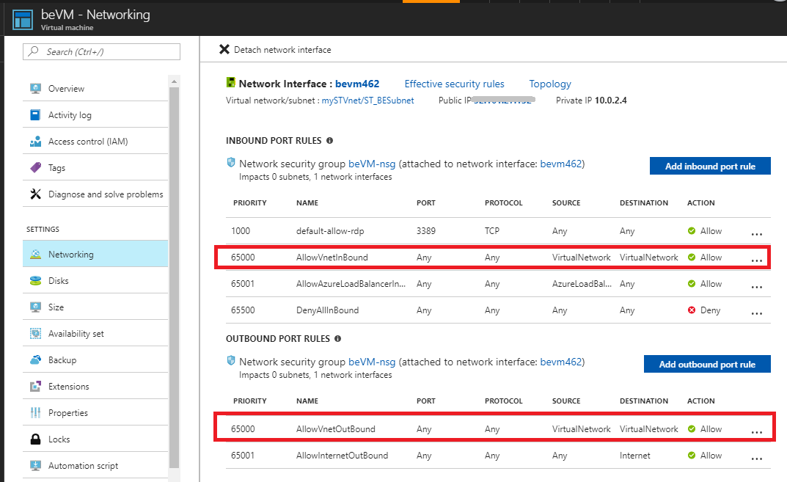

# <a name="troubleshoot-azure-vm-connectivity-problems"></a>Azure VM の接続に関する問題のトラブルシューティング

この記事は、管理者が Azure 仮想マシン (VM) に影響する接続の問題を診断して解決するのに役立ちます。

## <a name="problems"></a>問題が発生した場合

- [Resource Manager を使用してデプロイされた Azure VM から同じ仮想ネットワーク内の別の Azure VM に接続できない](#azure-vm-cannot-connect-to-another-azure-vm-in-same-virtual-network)。
- [Azure VM から同じ仮想ネットワーク内の Azure VM の 2 つ目のネットワーク アダプターに接続できない](#azure-vm-cannot-connect-to-the-second-network-adapter-of-an-azure-vm-in-same-virtual-network)。
- [Azure VM からインターネットに接続できない](#azure-vm-cannot-connect-to-the-internet)。

これらの問題を解決するには、次のセクションの手順に従ってください。

## <a name="resolution"></a>解像度

### <a name="azure-vm-cannot-connect-to-another-azure-vm-in-same-virtual-network"></a>Azure VM から同じ仮想ネットワーク内の別の Azure VM に接続できない

#### <a name="step-1-verify-that-vms-can-communicate-with-each-other"></a>手順 1: VM が相互に通信できることを確認します。

1. ソース VM に TCping をダウンロードします。
2. コマンド プロンプト ウィンドウを開きます。
3. TCping をダウンロードしたフォルダーに移動します。
4. 次のコマンドを使用して、ソース VM から宛先に ping を実行します。

    

    ```cmd
    tcping64.exe -t <destination VM address> 3389
    ```

> [!TIP]
> ping テストが成功した場合は、手順 3 に進みます。 使用できない場合は、次の手順に進みます。

#### <a name="step-2-check-the-network-security-group-settings"></a>手順 2: ネットワーク セキュリティ グループ設定を確認します。

各 VM で、既定の受信ポート規則 ("AllowVnetInBound" と "AllowAzureLoadBalancerInBound") を確認します。 また、優先順位の低い規則の下に一致するブロッキング規則が一覧表示されていないことも確認してください。

> [!NOTE]
> 数値の小さい規則が先に照合されます。 たとえば、優先順位が 1000 および 6500 の規則がある場合、優先順位が 1000 の規則が先に照合されます。

その後、ソース VM から宛先にもう一度 ping を実行してみます。

```cmd
tcping64.exe -t <destination VM address> 3389
```

#### <a name="step-3-check-whether-you-can-connect-to-the-destination-vm-by-using-remote-desktop-or-ssh"></a>手順 3: リモート デスクトップまたは SSH を使用して宛先 VM に接続できるかどうかを確認します。

リモート デスクトップを使用して接続するには、次の手順を実行します。

**Windows**:

1. Azure portal にサインインします。
2. 左側のメニューで **[Virtual Machines]** を選択します。
3. 一覧から仮想マシンを選択します。
4. 仮想マシンのページで、 **[接続]** を選択します。

詳細については、「[Windows が実行されている Azure 仮想マシンに接続してサインオンする方法](../virtual-machines/windows/connect-logon.md)」を参照してください。

**Linux**:

詳細については、[Azure での Linux VM への接続](../virtual-machines/linux/quick-create-portal.md)に関する記事をご覧ください。

リモート デスクトップまたは SSH 接続が成功した場合は、次の手順に進みます。

#### <a name="step-4-perform-a-connectivity-check"></a>手順 4: 接続チェックを実行します。

ソース VM で接続チェックを実行し、応答を確認します。

**Windows**: [PowerShell を使用して Azure Network Watcher との接続を確認する](../network-watcher/network-watcher-connectivity-powershell.md)

**Linux**: [Azure CLI 2.0 を使用して Azure Network Watcher との接続を確認する](../network-watcher/network-watcher-connectivity-cli.md)

応答の例を次に示します。

```
ConnectionStatus : Unreachable
AvgLatencyInMs   :
MinLatencyInMs   :
MaxLatencyInMs   :
ProbesSent       : 100
ProbesFailed     : 100
Hops             : [
                     {
                       "Type": "Source",
                       "Id": "c5222ea0-3213-4f85-a642-cee63217c2f3",
                       "Address": "10.1.1.4",
                       "ResourceId": "/subscriptions/00000000-0000-0000-0000-000000000000/resourceGrou
                   ps/ContosoRG/providers/Microsoft.Network/networkInterfaces/appNic0/ipConfigurat
                   ions/ipconfig1",
                       "NextHopIds": [
                         "9283a9f0-cc5e-4239-8f5e-ae0f3c19fbaa"
                       ],
                       "Issues": []
                     },
                     {
                       "Type": "VirtualAppliance",
                       "Id": "9283a9f0-cc5e-4239-8f5e-ae0f3c19fbaa",
                       "Address": "10.1.2.4",
                       "ResourceId": "/subscriptions/00000000-0000-0000-0000-000000000000/resourceGrou
                   ps/ContosoRG/providers/Microsoft.Network/networkInterfaces/fwNic/ipConfiguratio
                   ns/ipconfig1",
                       "NextHopIds": [
                         "0f1500cd-c512-4d43-b431-7267e4e67017"
                       ],
                       "Issues": []
                     },
```

#### <a name="step-5-fix-the-issue-in-the-connectivity-check-result"></a>手順 5: 接続チェックの結果に含まれる問題を修正します。

1. 受信した接続チェック応答の **[Hops]** セクションで、一覧表示されている **問題** を確認します。

    

2. 次の表から対応する解決策を見つけ、示された手順に従って問題を解決します。

    |問題の種類  |値  |解決アクション |
    |---------|---------|---------|
    |NetworkSecurityRule|ブロックしている NSG の名前|[NSG 規則を削除](./manage-network-security-group.md#delete-a-security-rule)するか、[こちら](./manage-network-security-group.md#change-a-security-rule)の説明に従って規則を変更できます。|
    |UserDefinedRoute     |   ブロックしている UDR の名前      | このルートを必要としない場合は、UDR を削除します。 ルートを削除できない場合は、適切なアドレス プレフィックスとネクスト ホップを使用してルートを更新します。 また、トラフィックを適切に転送するようにネットワーク仮想アプライアンスを調整することもできます。 詳細については、「[仮想ネットワーク トラフィックのルーティング](./virtual-networks-udr-overview.md)」と「[PowerShell を使用してルート テーブルでネットワーク トラフィックをルーティングする](./tutorial-create-route-table-powershell.md)」を参照してください。|
    |CPU    |    使用     |     [Linux または Windows を実行する Azure 仮想マシンの一般的なパフォーマンスのトラブルシューティング](https://support.microsoft.com/en-in/help/3150851/generic-performance-troubleshooting-for-azure-virtual-machine-running)に関する記事で説明されている推奨事項に従ってください。|
    |メモリ    |      使用   |    [Linux または Windows を実行する Azure 仮想マシンの一般的なパフォーマンスのトラブルシューティング](https://support.microsoft.com/en-in/help/3150851/generic-performance-troubleshooting-for-azure-virtual-machine-running)に関する記事で説明されている推奨事項に従ってください。|
    |ゲスト ファイアウォール    |      ファイアウォール ブロックの名前   |      「[Windows Defender ファイアウォールを有効または無効にする](https://support.microsoft.com/help/4028544/windows-turn-windows-firewall-on-or-off)」の手順を実行します。|
    |DNS の解決     |    DNS の名前     |    「[Azure DNS トラブルシューティング ガイド](../dns/dns-troubleshoot.md)」および「[Azure 仮想ネットワーク内のリソースの名前解決](./virtual-networks-name-resolution-for-vms-and-role-instances.md)」の手順を実行します。     |
    |ソケット エラー    |      利用不可   |     指定されたポートは別のアプリケーションによって既に使用されています。 別のポートを使用してみてください。    |

3. 接続チェックをもう一度実行して、問題が解決されたかどうかを確認します。

### <a name="azure-vm-cannot-connect-to-the-second-network-adapter-of-an-azure-vm-in-same-virtual-network"></a>Azure VM から同じ仮想ネットワーク内の Azure VM の 2 つ目のネットワーク アダプターに接続できない

#### <a name="step-1-make-sure-that-the-second-network-adapter-is-enabled-to-talk-outside-the-subnet"></a>手順 1: 2 つ目のネットワーク アダプターでサブネットの外部との通信が有効になっていることを確認します。

既定では、セカンダリ ネットワーク アダプター (ネットワーク インターフェイス カードまたはネットワーク アダプターとも呼ばれます) は既定のゲートウェイを使用するように構成されていません。 そのため、セカンダリ アダプターのトラフィック フローは同じサブネットに制限されます。


セカンダリ ネットワーク アダプターが専用のサブネットの外部と通信できるようにする場合、ユーザーはルーティング テーブルにエントリを追加してゲートウェイを構成する必要があります。 これを行うには、次の手順に従います。

1. 2 つ目のネットワーク アダプターが構成されている VM で、管理者としてコマンド プロンプト ウィンドウを開きます。
2. 次のコマンドを実行して、ルーティング テーブルにエントリを追加します。

    ```cmd
    Route add 0.0.0.0 mask 0.0.0.0 -p <Gateway IP>
    ```

    たとえば、2 つ目の IP アドレスが 192.168.0.4 の場合、ゲートウェイ IP は 192.168.0.1 である必要があります。 次のコマンドを実行する必要があります。

    ```cmd
    Route add 0.0.0.0 mask 0.0.0.0 -p 192.168.0.1
    ```

3. route print を実行します。 エントリが正常に追加された場合は、次のようなエントリが表示されます。

    

ここで、セカンダリ ネットワーク アダプターへの接続を試みます。 接続がまだ失敗する場合は、次の手順に進みます。

#### <a name="step-2-check-nsg-settings-for-the-network-adapters"></a>手順 2: ネットワーク アダプターの NSG 設定を確認します。

プライマリとセカンダリの両方のネットワーク アダプターについて、ネットワーク アダプターの受信に対する既定の受信ポート規則 (AllowVnetInBound、AllowAzureLoadBalancerInBound) を確認します。 また、優先順位の低い規則の下に一致するブロッキング規則がないことを確認する必要があります。



#### <a name="step-3-run-a-connectivity-check-to-the-secondary-network-adapter"></a>手順 3: セカンダリ ネットワーク アダプターへの接続チェックを実行します。

1. セカンダリ ネットワーク アダプターへの接続チェックを実行します。
2. 環境全体で接続チェックを実行して、エンドツーエンドでプロセスが機能することを確認します。

接続チェックを実行する方法の詳細については、次の記事を参照してください。

**Windows**: [PowerShell を使用して Azure Network Watcher との接続を確認する](../network-watcher/network-watcher-connectivity-powershell.md)

**Linux**: [Azure CLI 2.0 を使用して Azure Network Watcher との接続を確認する](../network-watcher/network-watcher-connectivity-cli.md)。

応答の例を次に示します。

```
ConnectionStatus : Unreachable
AvgLatencyInMs   : 
MinLatencyInMs   : 
MaxLatencyInMs   : 
ProbesSent       : 100
ProbesFailed     : 100
Hops             : [
                     {
                       "Type": "Source",
                       "Id": "c5222ea0-3213-4f85-a642-cee63217c2f3",
                       "Address": "10.1.1.4",
                       "ResourceId": "/subscriptions/00000000-0000-0000-0000-000000000000/resourceGrou
                   ps/ContosoRG/providers/Microsoft.Network/networkInterfaces/appNic0/ipConfigurat
                   ions/ipconfig1",
                       "NextHopIds": [
                         "9283a9f0-cc5e-4239-8f5e-ae0f3c19fbaa"
                       ],
                       "Issues": []
                     },
                     {
                       "Type": "VirtualAppliance",
                       "Id": "9283a9f0-cc5e-4239-8f5e-ae0f3c19fbaa",
                       "Address": "10.1.2.4",
                       "ResourceId": "/subscriptions/00000000-0000-0000-0000-000000000000/resourceGrou
                   ps/ContosoRG/providers/Microsoft.Network/networkInterfaces/fwNic/ipConfiguratio
                   ns/ipconfig1",
                       "NextHopIds": [
                         "0f1500cd-c512-4d43-b431-7267e4e67017"
                       ],
                       "Issues": []
                     },
```

#### <a name="step-4-refer-the-table-under-step-5-and-follow-these-steps-to-resolve-the-issues"></a>手順 4: [手順 5](#step-5-fix-the-issue-in-the-connectivity-check-result) の表を参照し、これらの手順に従って問題を解決します。

### <a name="azure-vm-cannot-connect-to-the-internet"></a>Azure VM からインターネットに接続できない

#### <a name="step-1-check-whether-the-network-adapter-is-in-a-failed-state"></a>手順 1: ネットワーク アダプターが失敗状態であるかどうかを確認します。

次の手順に従って NIC の状態を確認します。

1. リソース エクスプローラー ポータルにログインします。
2. 左側のウィンドウで、 **[サブスクリプション]** を選択します。
3. 左側のウィンドウで、影響を受けるネットワーク アダプターまたは VM が属しているリソース グループを選択します。
4. **[Microsoft ネットワーク]** に移動します。
5. **[ネットワーク インターフェイス]** オプションを選択します。
6. 影響を受けるネットワーク インターフェイスを選択します。
7. ポータルの上部にある **[読み取り/書き込み]** オプションを選択します。
8. **[編集]** オプションを選択します。

    

    > [!NOTE]
    > **[編集]** オプションを選択すると、[GET] オプションが **[PUT]** オプションに変わります。

    

9. 影響を受けるネットワーク インターフェイスを選択してから、 **[PUT]** オプションを選択します。

    > [!NOTE]
    > この選択を行った後、**ProvisioningState** が **Updating** として表示されます。 通常の Azure Resource Manager ポータルでも同じ結果が表示されます。 操作が正常に完了すると、次に示すように **ProvisioningState** の値が **Succeeded** に変わります。
10. ポータルを更新します。 ネットワーク アダプターが成功状態になります。

#### <a name="step-2-follow-step-4-to-run-a-connectivity-check"></a>手順 2: [手順 4](#step-4-perform-a-connectivity-check) に従って接続チェックを実行します。

#### <a name="step-3-refer-the-table-under-step-5-and-follow-the-steps-to-resolve-the-issues"></a>手順 3: [手順 5](#step-5-fix-the-issue-in-the-connectivity-check-result) の表を参照し、手順に従って問題を解決します。

## <a name="next-steps"></a>次のステップ

[Azure VM 間の接続に関する問題のトラブルシューティング](./virtual-network-troubleshoot-connectivity-problem-between-vms.md)
